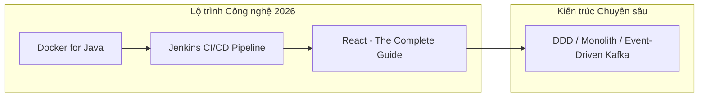

# 🌟 HỆ THỐNG QUẢN TRỊ CUỘC SỐNG & SỰ NGHIỆP TOÀN DIỆN
> **Chủ đề cốt lõi:** *Sống tối giản – Làm việc sâu – Vững vàng nền tảng – Bảo vệ gia đình*  
> **Chủ nhân:** Nguyễn Bá Tuấn Anh (WanBi / @anhnbt)

---

## 🎯 TUYÊN NGÔN CÁ NHÂN (PERSONAL MANIFESTO)
1. **Gia đình là ưu tiên số 1:** Mọi nỗ lực kiếm tiền và phát triển sự nghiệp đều nhằm bảo vệ sự bình an và không tạo rủi ro cho gia đình.
2. **Không đánh đổi sức khỏe lấy thành tích ngắn hạn:** Ngủ đủ 7–8 tiếng, duy trì thể trạng 70kg và sự an yên trong tâm trí.
3. **Làm việc có tâm và chuẩn mực:** Làm chậm mà chắc, tôn trọng bối cảnh hệ thống, không phức tạp hóa vấn đề.
4. **Tối giản (Danshari):** Phòng ốc gọn gàng, tâm trí tĩnh lặng, nói ít lắng nghe nhiều, không khoe khoang.

---

## 🚨 PHẦN 1: CHIẾN DỊCH CẤP BÁCH — "ZERO-NIGHT-DEPLOY" & GIẢI PHÓNG NĂNG LƯỢNG

```
[Ban ngày: Hệ thống lớn] ──► [Tối: Dạy học 3 buổi] ──► [Đêm: Thức deploy thủ công]
                                                               │ (Vòng lặp kiệt sức)
                                                               ▼
[GIẢI PHÁP]: Tự động hóa CI/CD + Chuyển Release sang Giờ hành chính (14h00)
```

### 1. Quy tắc Vàng về Triển khai (Deployment Policy)
* ⛔ **Tuyệt đối KHÔNG deploy sau 21h00 hoặc vào cuối tuần.**
* 🕒 **Khung giờ Release chuẩn:** **10h00 sáng** hoặc **14h00 chiều** (Thứ Ba – Thứ Năm). Có sự cố sẽ xử lý ngay trong giờ làm việc khi tinh thần tỉnh táo nhất.
* 🚀 **Tự động hóa 1-Click (Quick-wins):**
  * Viết script shell `deploy.sh` hoặc cấu hình GitHub Actions / GitLab CI tự động build & deploy.
  * Ứng dụng Docker & Nginx Reverse Proxy (Blue-Green Deployment cơ bản) để đạt **Zero-Downtime**, không làm gián đoạn người dùng.

### 2. Tối ưu Năng lượng Giảng dạy & Hỗ trợ
* **Khung giờ hỗ trợ cứng (Office Hours):** Chỉ hỗ trợ học viên trong giờ học hoặc trước 22h00.
* **Chuẩn hóa học liệu:** Tái sử dụng template code mẫu, video hướng dẫn và checklist lỗi thường gặp để giảm tải việc giải thích thủ công.
* **Quy tắc 22h00:** Đóng toàn bộ IDE/Terminal, không kiểm tra tin nhắn công việc hay học viên sau 22h00.

---

## 🧘 PHẦN 2: THÂN – TÂM – TRÍ & GIA ĐÌNH

### 1. Thân (Sức khỏe Thể chất & Dinh dưỡng)
* 🎯 **Mục tiêu:** Tăng cân lành mạnh đạt mốc **70 kg**.
* 🥗 **Dinh dưỡng:** Ăn đủ bữa, kiểm soát Macro (Protein, Carbs, Fat) và Calories nạp vào (Surplus calo). Bổ sung bữa phụ lúc 21h30 (sữa hạt, yến mạch, whey...).
* 🏃 **Vận động:** Đi bộ / tập thể dục sáng sớm **20 – 30 phút mỗi ngày**.
* 😴 **Giấc ngủ:** Ngủ trước **23h00**, thức dậy lúc **06h30** (đảm bảo đủ **7.5 – 8 tiếng** ngủ sâu).

### 2. Tâm (Tối giản & Đời sống Tinh thần)
* 🧘 **Thiền định:** Dành 10 – 15 phút mỗi sáng hoặc trước khi ngủ để tĩnh tâm.
* 🧹 **Lối sống tối giản kiểu Nhật:** Phòng ốc luôn ngăn nắp; định kỳ thanh lọc, loại bỏ đồ đạc không còn giá trị sử dụng.
* 🤫 **Tâm thế:** Khiêm nhường, không khoe khoang, lắng nghe nhiều hơn.

### 3. Trí (Phát triển Bản thân)
* 📖 **Đọc sách:** Duy trì **3 – 4 cuốn/tháng** (tối thiểu 30 trang hoặc 30 phút mỗi ngày).
* ⏳ **Quy tắc 10.000 giờ:** Kiên trì mài giũa chuyên môn lập trình & kiến trúc hệ thống (~3.5 năm rèn luyện có chủ đích).

### 4. Gia đình & Mối quan hệ
* Dành thời gian trọn vẹn, không dính líu đến điện thoại/máy tính khi ở bên ông bà, bố mẹ, vợ con, anh chị.
* Chủ động học hỏi, giao lưu và mở rộng mối quan hệ với những người giỏi và giàu trải nghiệm hơn mình.

---

## 💻 PHẦN 3: LỘ TRÌNH KỸ THUẬT & TỦ SÁCH TINH HOA 2026



### 1. Lộ trình Khóa học Kỹ thuật (Tech Roadmap)
1. **HANDS ON DOCKER for Java Developers:** Đóng gói Spring Boot app, Multi-stage builds, tối ưu container resources.
2. **The Complete Jenkins DevOps CI/CD Pipeline Bootcamp:** Viết Jenkinsfile tự động hóa toàn bộ quy trình Build, Test, Dockerize và Deploy.
3. **React – The Complete Guide (Maximilian):** Nắm vững React Hooks, State Management, Next.js để hoàn thiện năng lực Full-stack hiện đại.

### 2. Tủ sách Tinh hoa 2026 (5 Tác phẩm Cốt lõi)
| Sách | Tác giả | Ứng dụng thực tế |
| :--- | :--- | :--- |
| **Deep Work** | Cal Newport | Thiết lập các khối giờ làm việc sâu, loại bỏ xao nhãng và việc lặt vặt. |
| **Flow** | Mihaly Csikszentmihalyi | Đạt trạng thái dòng chảy, tìm thấy niềm vui và sự thăng hoa trong công việc. |
| **Clean Code** | Robert C. Martin | Viết mã nguồn sạch, có nghĩa, dễ bảo trì cho các hệ thống lớn. |
| **The Pragmatic Programmer** | Andy Hunt & Dave Thomas | Rèn tư duy thực dụng, chuyên nghiệp và trách nhiệm của một Software Craftsman. |
| **The Five Dysfunctions of a Team** | Patrick Lencioni | Nâng cao kỹ năng lãnh đạo đội nhóm, xây dựng niềm tin và sự gắn kết. |

### 3. Phân bổ Thực thi theo 4 Quý (Quarterly Roadmap)
* **Quý 1:** Docker for Java + Đọc *Deep Work* & *Flow* + Củng cố nhịp ngủ 7-8h và thể dục sáng.
* **Quý 2:** Jenkins DevOps CI/CD Bootcamp + Đọc *Clean Code* + Tự động hóa dứt điểm hệ thống deploy.
* **Quý 3:** React Complete Guide (Phần 1) + Đọc *The Pragmatic Programmer* + Đánh giá mục tiêu 70kg.
* **Quý 4:** React Complete Guide (Phần 2: Advanced) + Đọc *The Five Dysfunctions of a Team* + Tổng kết năm.

---

## 📈 PHẦN 4: TÀI CHÍNH & KINH DOANH BỀN VỮNG

* **Đa dạng hóa:** Xây dựng và duy trì **≥ 3 nguồn thu nhập** độc lập.
* **Nguyên tắc phân bổ thu nhập:** Tiết kiệm kỷ luật theo tỷ lệ **30% – 20% – 10%**.
* **Quỹ dự phòng an toàn:** Giữ lại **15% lợi nhuận mỗi năm** cho quỹ dự phòng rủi ro gia đình.
* **Chiến lược sản phẩm:** 
  * Dự án ngắn: Xoay vòng vốn nhanh, thu tiền đều đặn.
  * Dịch vụ cốt lõi: Phải đạt tiêu chuẩn **dẫn đầu, có tâm và chất lượng vượt trội**.
* **Nâng cao năng suất:** Đầu tư vào thiết bị (*MacBook Pro 16 M3 Pro*, *ThinkPad X1 Carbon Gen 7*) và công cụ để tăng ít nhất **5% – 10% năng suất**.

---

## 🔍 PHẦN 5: SỔ TAY KỸ THUẬT SEO MASTER

- [ ] **SEO Title:** Tối đa **60 ký tự**, từ khóa chính ở **ngay đầu tiêu đề**, nêu rõ lợi ích.
- [ ] **SEO Meta Description:** Tối đa **160 ký tự**, chứa từ khóa chính + CTA rõ ràng.
- [ ] **Nội dung:** Viết sâu và rộng; từ khóa chính xuất hiện trong **câu đầu tiên**; ưu tiên làm từ khóa dễ/long-tail trước.
- [ ] **Vị trí tối ưu nội dung / Ads (Placement):**
  - `mid_content`: Sau Paragraph 2 (Mobile & Desktop).
  - `long_content`: Sau Paragraph 5 (Mobile & Desktop).
- [ ] **Technical:**
  - Tỷ lệ: `Internal Links > Outbound Links`.
  - Khai báo đầy đủ `width` & `height` của ảnh.
  - Tối ưu Mobile / Responsive chuẩn mực.
  - Địa chỉ đầy đủ ở chân trang (Footer) + Số điện thoại định dạng chuẩn quốc tế `+84...`.

---

## ⏰ LỊCH TRÌNH MẪU HÀNG NGÀY (DAILY FLOW)

```
05:30 ──► Thức dậy, uống nước ấm, thiền tĩnh tâm (15p)
06:00 ──► Đi bộ thể dục sáng (20-30p) + Bữa sáng giàu dinh dưỡng (Macro chuẩn)
06:45 ──► Đọc sách 30 trang + Chọn 3-5 mục tiêu quan trọng nhất ngày
08:00 ──► DEEP WORK BLOCK 1 (Công việc hệ thống, tập trung cao độ)
12:00 ──► Ăn trưa + Nghỉ trưa 20-30 phút
13:30 ──► DEEP WORK BLOCK 2 (Code, Review, Release vào 14h00 nếu có lịch)
17:30 ──► Dành trọn thời gian cho gia đình, ăn tối cùng vợ con
19:30 ──► Dạy học (hoặc học Docker/Jenkins/React 45-60p nếu không có ca dạy)
21:30 ──► Dọn dẹp phòng ngăn nắp + Bữa phụ dinh dưỡng (hướng mốc 70kg)
22:00 ──► ĐÓNG MÁY TÍNH / THẢ LỎNG (Đọc sách, nghe nhạc nhẹ)
22:45 ──► LÊN GIƯỜNG NGỦ (Đảm bảo 7.5 - 8 tiếng ngủ sâu)
```
