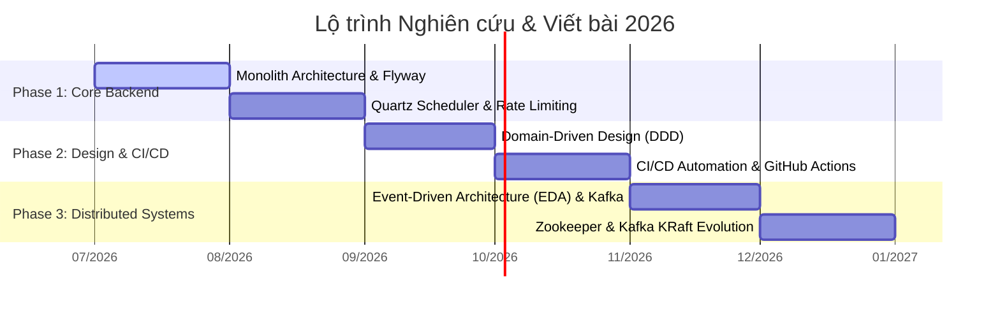

# Lộ trình Tìm hiểu & Viết bài Blog Công nghệ 2026

Dưới đây là lộ trình chi tiết giúp bạn nghiên cứu sâu và viết bài chia sẻ về **9 chủ đề công nghệ cốt lõi** trong 6 tháng cuối năm 2026 (từ tháng 7/2026 đến tháng 12/2026). Lộ trình đi từ cấu trúc ứng dụng đơn lẻ (Monolith), các kỹ thuật tối ưu backend, DevOps, cho đến kiến trúc hệ phân tán (Distributed & Event-Driven Systems).

---

## 📅 Chi tiết lộ trình theo tháng

### 🧱 Tháng 07/2026: Kiến trúc Monolith & Quản lý Database Migration
> **Mục tiêu:** Hiểu rõ điểm xuất phát của mọi hệ thống phần mềm và cách quản lý phiên bản database chuyên nghiệp.

#### Bài viết 1: Monolith Architecture (Kiến trúc nguyên khối) là gì?
*   **Thời gian:** Tuần 1 & 2 (Tháng 7)
*   **Kiến thức trọng tâm:**
    *   Định nghĩa truyền thống của Monolith và cấu trúc Three-tier Architecture.
    *   Tại sao Monolith vẫn rất sống động trong năm 2026 (khái niệm **Modular Monolith**).
    *   So sánh ưu và nhược điểm thực tế với Microservices (chi phí, độ phức tạp, tốc độ phát triển ban đầu).
*   **Dàn ý bài viết dự kiến:**
    1.  *Đặt vấn đề:* Trào lưu Microservices đã thoái trào như thế nào và sự trở lại của Monolith.
    2.  *Định nghĩa:* Monolith là gì?
    3.  *Phân loại:* Single Monolith vs Modular Monolith.
    4.  *Đánh giá:* Khi nào nên chọn Monolith? Khi nào bắt buộc phải chia nhỏ?

#### Bài viết 2: Flyway là gì? Quản lý Database Schema Migration chuyên nghiệp
*   **Thời gian:** Tuần 3 & 4 (Tháng 7)
*   **Kiến thức trọng tâm:**
    *   Database Migration là gì? Tại sao không nên sửa DB bằng tay (run script sql thủ công).
    *   Nguyên lý hoạt động của Flyway (bảng `flyway_schema_history`).
    *   Quy tắc đặt tên file script (`V1__`, `U1__`, `R__`).
    *   Tích hợp Flyway vào dự án Java (Spring Boot) hoặc Node.js.
*   **Dàn ý bài viết dự kiến:**
    1.  *Nỗi đau:* "Ủa sao database local của em chạy được mà lên staging bị lỗi thiếu cột?"
    2.  *Giải pháp:* Giới thiệu Flyway và cách nó hoạt động.
    3.  *Thực hành:* Hướng dẫn tích hợp Flyway vào một dự án Spring Boot đơn giản.
    4.  *Kinh nghiệm thực tế:* Cách xử lý lỗi checksum, cách viết migration khi hệ thống đã có sẵn dữ liệu.

---

### ⏳ Tháng 08/2026: Lập lịch tác vụ & Bảo vệ API (Resilience)
> **Mục tiêu:** Giải quyết bài toán chạy tác vụ ngầm trong hệ thống lớn và bảo vệ dịch vụ trước lượng truy cập quá tải.

#### Bài viết 3: Quartz Scheduler là gì? Giải pháp lập lịch công việc trong Java Enterprise
*   **Thời gian:** Tuần 1 & 2 (Tháng 8)
*   **Kiến thức trọng tâm:**
    *   Các thành phần chính: `Job`, `JobDetail`, `Trigger` (SimpleTrigger, CronTrigger), `Scheduler`.
    *   Sự khác biệt giữa Spring `@Scheduled` (chỉ chạy memory, dễ mất dấu nếu restart app) và Quartz (lưu trạng thái vào DB).
    *   Cách cấu hình Quartz ở chế độ **Cluster** (nhiều node cùng đọc một DB để tránh chạy trùng lặp).
*   **Dàn ý bài viết dự kiến:**
    1.  *Đặt vấn đề:* Viết tính năng gửi email chúc mừng sinh nhật lúc 8h sáng hàng ngày trong hệ thống chạy 5 instance thế nào để user không nhận 5 cái mail trùng nhau?
    2.  *Quartz Scheduler:* Các khái niệm cốt lõi.
    3.  *Demo:* Cấu hình Quartz lưu JobStore trong PostgreSQL/MySQL với Spring Boot.
    4.  *Góc nâng cao:* Giải thích cơ chế Misfire (khi Job bị lỡ giờ chạy thì xử lý thế nào).

#### Bài viết 4: Rate Limiting là gì? Thiết kế lá chắn bảo vệ API khỏi overload
*   **Thời gian:** Tuần 3 & 4 (Tháng 8)
*   **Kiến thức trọng tâm:**
    *   Tại sao cần giới hạn lượt truy cập (chống DDoS, chống spam, kiểm soát chi phí API bên thứ 3).
    *   **4 thuật toán kinh điển:** Token Bucket, Leaky Bucket, Sliding Window Log, Sliding Window Counter.
    *   Cách triển khai: Ở tầng Application (dùng Bucket4j / Redis trong Spring Boot) vs Tầng Gateway (Kong, Nginx).
*   **Dàn ý bài viết dự kiến:**
    1.  *Tình huống thực tế:* Server sập vì một script crawler cào dữ liệu vô tội vạ.
    2.  *Giải pháp:* Rate Limiting là gì?
    3.  *Phân tích thuật toán:* Giải thích trực quan 4 thuật toán bằng hình ảnh hoặc ví dụ sinh động.
    4.  *Thực hành:* Hướng dẫn viết một Rate Limiter filter đơn giản bằng Spring Boot + Redis.

---

### 🎨 Tháng 09/2026: Thiết kế kiến trúc dựa trên nghiệp vụ (Domain-Driven Design)
> **Mục tiêu:** Thay đổi tư duy từ "Thiết kế hướng database" sang "Thiết kế hướng nghiệp vụ", chuẩn bị cho việc xây dựng các hệ thống lớn, phân tán.

#### Bài viết 5: Domain-Driven Design (DDD) là gì? Tư duy thiết kế phần mềm hiện đại
*   **Thời gian:** Trọn vẹn tháng 9 (đây là chủ đề rất khó, cần nhiều thời gian tự học và chiêm nghiệm).
*   **Kiến thức trọng tâm:**
    *   **Strategic Design (Thiết kế chiến lược):** Ubiquitous Language (Ngôn ngữ chung), Bounded Context, Context Mapping (bản đồ ngữ cảnh).
    *   **Tactical Design (Thiết kế chiến thuật):** Entity, Value Object, Aggregate Root, Repository, Domain Service, Domain Event.
    *   Cách DDD giúp chuyển đổi từ Monolith sang Microservices một cách mượt mà thông qua việc phân rã các Bounded Context.
*   **Dàn ý bài viết dự kiến:**
    1.  *Đặt vấn đề:* Tại sao mã nguồn dự án sau 1-2 năm thường trở thành "bãi rác" (Spaghetti code) khó bảo trì? Do chúng ta tập trung vào database thay vì nghiệp vụ.
    2.  *Giới thiệu DDD:* Bản chất của DDD là gì?
    3.  *Strategic Design:* Cách thảo luận với Business Analyst (BA) để vẽ ranh giới hệ thống (Bounded Context).
    4.  *Tactical Design:* Phân biệt Entity vs Value Object qua ví dụ thực tế (vd: `User` vs `Address`).
    5.  *Lời khuyên:* Khi nào KHÔNG nên dùng DDD (hệ thống CRUD đơn giản).

---

### ⚙️ Tháng 10/2026: Tự động hóa quy trình phân phối phần mềm (CI/CD)
> **Mục tiêu:** Nắm vững quy trình DevOps hiện đại, giúp giải phóng sức lao động khi deploy ứng dụng.

#### Bài viết 6: CI/CD là gì? Tự động hóa từ code local đến môi trường Production
*   **Thời gian:** Trọn vẹn tháng 10
*   **Kiến thức trọng tâm:**
    *   Khái niệm: Continuous Integration (Tích hợp liên tục) và Continuous Delivery/Deployment (Phân phối/Triển khai liên tục).
    *   Các công cụ phổ biến: GitHub Actions, GitLab CI, Jenkins.
    *   Một Pipeline hoàn chỉnh gồm những gì: Lint, Unit Test, Build Artifact (Docker Image), Push registry, Deploy server.
*   **Dàn ý bài viết dự kiến:**
    1.  *Cảnh tượng quen thuộc:* Lập trình viên build file `.jar` hoặc file nén rồi SSH vào server, dùng `scp` để copy đè lên file cũ, rồi gõ `nohup java -jar ... &`. Quá nhiều rủi ro!
    2.  *CI/CD ra đời:* Giải thích quy trình tự động.
    3.  *Thực hành thực tế:* Hướng dẫn từng bước viết một file `.github/workflows/deploy.yml` để tự build dự án và đẩy Docker Image lên Docker Hub / GitHub Packages mỗi khi commit code vào nhánh `main`.

---

### 📨 Tháng 11/2026: Kiến trúc hướng sự kiện & Apache Kafka
> **Mục tiêu:** Chuyển dịch từ giao tiếp đồng bộ (REST API) sang giao tiếp bất đồng bộ (Asynchronous Event), tăng khả năng mở rộng (scalability) và giảm liên kết lỏng (decoupling).

#### Bài viết 7: Event-Driven Architecture (EDA) là gì?
*   **Thời gian:** Tuần 1 & 2 (Tháng 11)
*   **Kiến thức trọng tâm:**
    *   Sự khác biệt giữa Request-Response (Đồng bộ) và Event-Driven (Bất đồng bộ).
    *   Khái niệm Event (Sự kiện) vs Command (Lệnh).
    *   Lợi ích của EDA: Tăng khả năng chịu tải, hệ thống mượt mà hơn, các service không cần biết sự tồn tại của nhau.
    *   Thách thức: Eventual Consistency (Nhất quán sau cùng), Outbox Pattern để tránh lỗi gửi event mà DB rollback.
*   **Dàn ý bài viết dự kiến:**
    1.  *Kịch bản:* Hệ thống E-commerce. Khi user mua hàng thành công: Trừ kho, tạo hóa đơn, gửi email, cộng điểm thưởng. Nếu gọi REST API tuần tự, chỉ cần một dịch vụ lỗi (ví dụ mail sập) cả luồng sẽ sập hoặc chạy rất chậm.
    2.  *Giải pháp:* Chuyển sang EDA - Service Order bắn ra event `OrderCreated` và đi làm việc khác. Các service khác tự lắng nghe và xử lý.
    3.  *Các mẫu thiết kế quan trọng trong EDA:* Saga Pattern, Transactional Outbox Pattern.

#### Bài viết 8: Apache Kafka là gì? Trái tim của hệ thống Event Streaming
*   **Thời gian:** Tuần 3 & 4 (Tháng 11)
*   **Kiến thức trọng tâm:**
    *   Kafka không chỉ là Message Queue (như RabbitMQ), nó là một distributed commit log.
    *   Các khái niệm cốt lõi: Broker, Topic, Partition, Offset, Producer, Consumer, Consumer Group.
    *   Cơ chế Partitioning giúp Kafka có throughput cực kỳ khủng khiếp.
*   **Dàn ý bài viết dự kiến:**
    1.  *Giới thiệu:* Kafka là gì và tại sao nó lại được dùng ở các công ty lớn (Netflix, Uber, LinkedIn).
    2.  *Kiến trúc cốt lõi:* Giải thích trực quan Topic, Partition, Offset. Cách Consumer Group hoạt động để chia tải.
    3.  *Demo:* Dựng Kafka bằng Docker Compose và viết code Spring Boot đơn giản để gửi/nhận message.

---

### 🕸️ Tháng 12/2026: Điều phối hệ thống phân tán & Sự dịch chuyển công nghệ
> **Mục tiêu:** Tìm hiểu sâu về hạ tầng quản lý hệ phân tán và cách công nghệ tự tiến hóa.

#### Bài viết 9: ZooKeeper là gì? Vai trò điều phối phân tán và Kỷ nguyên KRaft của Kafka
*   **Thời gian:** Trọn vẹn tháng 12
*   **Kiến thức trọng tâm:**
    *   ZooKeeper là gì? Vai trò của nó trong việc quản lý cấu hình, bầu chọn Leader (Leader Election) và đồng thuận hệ thống phân tán.
    *   Mối quan hệ lịch sử giữa Kafka và ZooKeeper.
    *   **Xu hướng 2026:** Tại sao Kafka loại bỏ ZooKeeper và chuyển sang **KRaft (Kafka Raft Metadata Mode)**? Lợi ích của KRaft (đơn giản hóa hạ tầng, chịu tải tốt hơn với hàng triệu partition).
*   **Dàn ý bài viết dự kiến:**
    1.  *Giới thiệu:* Zookeeper - Người giữ sở thú của các ứng dụng phân tán lớn.
    2.  *Zookeeper làm gì cho Kafka?* (Quản lý danh sách Broker, lưu trữ metadata của Topic, bầu chọn Leader Partition).
    3.  *Tạm biệt Zookeeper:* Giới thiệu cơ chế KRaft. Cách tự cấu hình một cluster Kafka chạy chế độ KRaft không cần Zookeeper.
    4.  *Bài học rút ra:* Sự phát triển của kiến trúc hệ thống và xu hướng đơn giản hóa hạ tầng (Self-contained systems).

---

## 💡 Lời khuyên để học và viết hiệu quả

1.  **Học bằng cách làm (Learn by Doing):**
    *   Với mỗi chủ đề, hãy tạo một repository nhỏ trên GitHub chứa mã nguồn thử nghiệm. Đưa link repo này vào bài viết. Người đọc cực kỳ thích các bài viết có code demo chạy được ngay.
2.  **Sử dụng sơ đồ trực quan:**
    *   Các chủ đề như *Rate Limiting*, *DDD*, *Kafka*, *EDA* rất khó giải thích bằng lời. Hãy dùng công cụ vẽ hình như **Excalidraw** hoặc **Mermaid** để trực quan hóa luồng dữ liệu. Một bức ảnh đáng giá ngàn lời nói!
3.  **Tối ưu SEO cho bài viết (Context: Gatsby Blog):**
    *   *Từ khóa chính:* Đưa ngay vào tiêu đề (H1), đoạn mở đầu (100 từ đầu tiên) và thẻ mô tả (meta description).
    *   *URL thân thiện (slug):* Đặt ngắn gọn, ví dụ `/domain-driven-design-la-gi`, `/tim-hieu-apache-kafka`.
    *   *Cấu trúc bài viết:* Sử dụng thẻ H2, H3 hợp lý, chia nhỏ các đoạn văn để người đọc không bị ngấy trên thiết bị di động.
4.  **Tạo thói quen ghi chú:**
    *   Khi nghiên cứu tài liệu từ các trang uy tín (Baeldung, Medium, các blog công nghệ lớn), hãy ghi chép lại các case-study thực tế hoặc các lỗi bạn gặp phải khi chạy thử nghiệm. Trải nghiệm thực tế bị lỗi rồi sửa chính là "gia vị" giúp bài viết của bạn độc bản và giá trị hơn các bài dịch lý thuyết suông.
