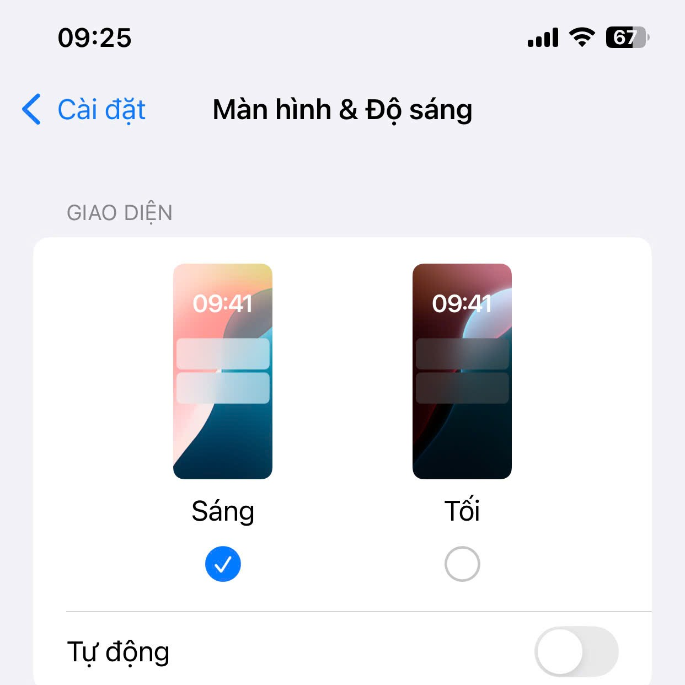

## Tổng Quan

Chào mừng bạn đến với phần đầu tiên trong bộ đề luyện tập JavaScript dành cho người mới bắt đầu! Đây là bước khởi đầu quan trọng trên hành trình lập trình của bạn. Chúng ta sẽ cùng nhau tìm hiểu về những viên gạch nền tảng nhất của JavaScript: **biến, kiểu dữ liệu và toán tử**.

Hãy tưởng tượng bạn đang xây một ngôi nhà. Biến giống như những chiếc hộp để chứa vật liệu, kiểu dữ liệu là nhãn dán cho biết bên trong hộp chứa gì (gạch, cát, hay xi măng), còn toán tử chính là những công cụ (cái bay, xô, búa) để bạn xử lý các vật liệu đó. Nắm vững những khái niệm này, bạn sẽ có một nền tảng vững chắc để xây dựng bất cứ thứ gì bạn muốn với JavaScript.

> **Luyện tập là cách tốt nhất để thành thạo JavaScript!**  
> Hãy đảm bảo thực hành tất cả các bài tập dưới đây.

---

## Phần 1: Biến, Kiểu dữ liệu và Toán tử

### Kiến thức cần nhớ

- **Biến (Variable)**: Là một tên gọi được đặt cho một vùng nhớ dùng để lưu trữ dữ liệu. Trong JavaScript hiện đại, chúng ta sử dụng hai từ khóa chính để khai báo biến:
    - `let`: Dùng để khai báo các biến mà giá trị của chúng có thể thay đổi sau này.
    - `const` (Constant - Hằng số): Dùng để khai báo các biến mà giá trị của chúng không thay đổi trong suốt chương trình.
    - `var`: Là cách khai báo biến cũ hơn. Bạn nên ưu tiên sử dụng `let` và `const` để code dễ hiểu và tránh lỗi.

- **Kiểu dữ liệu (Data Type)**: Là cách phân loại dữ liệu. JavaScript có các kiểu dữ liệu cơ bản (primitive types) sau:
    - **`string`**: Dùng để lưu trữ văn bản, được đặt trong dấu nháy đơn `'...'` hoặc nháy kép `"..."`. Ví dụ: `"Hello World"`.
    - **`number`**: Dùng cho cả số nguyên và số thực. Ví dụ: `30`, `3.14`.
    - **`boolean`**: Chỉ có hai giá trị: `true` (đúng) hoặc `false` (sai). Thường dùng trong các cấu trúc điều kiện.
    - **`undefined`**: Một biến đã được khai báo nhưng chưa được gán giá trị.
    - **`null`**: Đại diện cho sự "vắng mặt" của một giá trị một cách có chủ đích.

- **Toán tử (Operator)**: Là các ký hiệu dùng để thực hiện các phép toán.
    - **Toán tử số học**: `+` (cộng), `-` (trừ), `*` (nhân), `/` (chia), `%` (chia lấy dư), `**` (lũy thừa).
    - **Toán tử gán**: `=` (gán), `+=` (cộng và gán), `-=` (trừ và gán), v.v.
    - **Toán tử so sánh**: `>` (lớn hơn), `<` (nhỏ hơn), `===` (so sánh bằng nghiêm ngặt, cả giá trị và kiểu), `!==` (so sánh không bằng nghiêm ngặt). **Lưu ý**: Nên dùng `===` thay cho `==` để tránh các lỗi tiềm ẩn.
    - **Toán tử logic**: `&&` (AND - và), `||` (OR - hoặc), `!` (NOT - phủ định).
    - **Toán tử `typeof`**: Trả về một chuỗi cho biết kiểu dữ liệu của một biến.

### Bài tập

> **Lời khuyên**: Hãy tự mình làm các bài tập trước khi xem lời giải. Sau đó so sánh kết quả của bạn với lời giải để học hỏi thêm!

#### 1. Khai báo biến và hằng

- Khai báo một biến `name` kiểu chuỗi và gán tên của bạn vào đó.
- Khai báo một biến `age` kiểu số nguyên và gán tuổi của bạn.
- Khai báo một hằng `YEAR_OF_BIRTH` với giá trị là năm sinh của bạn.
- In giá trị của `name`, `age`, và `YEAR_OF_BIRTH` ra console.

<details>
<summary>**Xem lời giải**</summary>

```javascript
// Khai báo biến và hằng
let name = "WanBi";
let age = 30;
const YEAR_OF_BIRTH = 1994;

// In ra console
console.log("Tên:", name);
console.log("Tuổi:", age);
console.log("Năm sinh:", YEAR_OF_BIRTH);
```
</details>

#### 2. Thay đổi giá trị và kiểm tra kiểu dữ liệu

- Gán lại giá trị cho biến `age` thành tuổi của bạn vào năm sau. In giá trị mới ra console.
- Sử dụng toán tử `typeof` để kiểm tra kiểu dữ liệu của `name`, `age`, và `YEAR_OF_BIRTH`. In kết quả ra console.

<details>
<summary>**Xem lời giải**</summary>

```javascript
// Gán lại giá trị
age = age + 1;    // Cách đầy đủ
// hoặc 
age += 1;         // Cách viết gọn hơn
// hoặc
age++;            // Cách viết gọn nhất
console.log("Tuổi vào năm sau:", age);

// Kiểm tra kiểu dữ liệu
console.log("Kiểu dữ liệu của name:", typeof name);  // Kết quả: string
console.log("Kiểu dữ liệu của age:", typeof age);    // Kết quả: number
console.log("Kiểu dữ liệu của YEAR_OF_BIRTH:", typeof YEAR_OF_BIRTH); // Kết quả: number
```
</details>

#### 3. Sử dụng toán tử

- Khai báo hai biến số `x = 10` và `y = 4`.
- Thực hiện các phép toán cộng, trừ, nhân, chia, chia lấy phần dư (%) giữa `x` và `y`. In kết quả của mỗi phép toán ra console.
- Sử dụng toán tử tăng (`++`) cho `x` và toán tử giảm (`--`) cho `y`. In giá trị mới của `x` và `y` ra console.
- Tạo hai biến boolean `isDarkModeEnabled = false` và `is24HourTimeFormat = true` (lấy cảm hứng từ cài đặt trên iPhone). Sử dụng toán tử logic `&&` (AND), `||` (OR), `!` (NOT) với hai biến này để mô phỏng các điều kiện logic. In kết quả ra console.

<details>
<summary>**Xem lời giải**</summary>

```javascript
// Khai báo biến số
let x = 10;
let y = 4;

// Thực hiện phép toán cơ bản
console.log("x + y =", x + y);    // Kết quả: 14
console.log("x - y =", x - y);    // Kết quả: 6
console.log("x * y =", x * y);    // Kết quả: 40
console.log("x / y =", x / y);    // Kết quả: 2.5
console.log("x % y =", x % y);    // Kết quả: 2 (phần dư của 10 ÷ 4)

// Sử dụng toán tử tăng/giảm
x++;  // tăng x lên 1
y--;  // giảm y đi 1
console.log("x sau khi tăng:", x);  // Kết quả: 11
console.log("y sau khi giảm:", y);  // Kết quả: 3
```

**Toán tử logic với ví dụ từ cài đặt iPhone**

Để dễ hình dung, hãy xem qua các cài đặt trên điện thoại:

*Cài đặt màn hình & độ sáng*


*Cài đặt Ngày & Giờ*


Bây giờ, hãy biểu diễn các cài đặt này bằng biến và toán tử logic:

```javascript
// Khai báo biến boolean dựa trên hình minh họa
let isDarkModeEnabled = false; // Chế độ tối: tắt
let is24HourTimeFormat = true; // Định dạng thời gian 24 giờ: bật

// Kiểm tra các điều kiện logic
// Cả hai đều bật? (Chế độ tối VÀ định dạng 24 giờ)
console.log("isDarkModeEnabled && is24HourTimeFormat:", isDarkModeEnabled && is24HourTimeFormat);  // AND: false

// Có ít nhất một cái bật? (Chế độ tối HOẶC định dạng 24 giờ)
console.log("isDarkModeEnabled || is24HourTimeFormat:", isDarkModeEnabled || is24HourTimeFormat);  // OR: true

// Phủ định của Chế độ tối (isDarkModeEnabled đang là false -> true)
console.log("!isDarkModeEnabled:", !isDarkModeEnabled);    // NOT: true
```
</details>

## Hướng dẫn và lời khuyên

> **Cách học hiệu quả**: Hãy thử giải các bài tập trước khi xem đáp án. Sau đó so sánh giải pháp của bạn với lời giải. Phương pháp này giúp bạn rèn luyện kỹ năng giải quyết vấn đề và hiểu sâu hơn về các khái niệm.

### Cách thực thi code JavaScript

1. **Mở trình duyệt web** (Google Chrome hoặc Firefox là lựa chọn phổ biến)
2. **Mở Developer Console** bằng cách:
   - Nhấn phím tắt `F12` hoặc `Ctrl+Shift+J` (Windows/Linux) hoặc `Cmd+Option+J` (Mac)
   - Hoặc chuột phải vào trang web trống và chọn "Inspect" > "Console"
3. **Copy từng đoạn code** và dán vào Console
4. **Nhấn Enter** để thực thi và xem kết quả ngay lập tức

### Phương pháp thực hành hiệu quả

1.  **Thực hành từng bước:** Thực hiện lần lượt từng bài tập theo hướng dẫn.
2.  **Thử nghiệm:** Thay đổi giá trị của các biến và dự đoán kết quả trước khi chạy code.
3.  **Ghi chú:** Viết lại ý hiểu của bạn về mỗi khái niệm sau khi thực hành.
4.  **Quy tắc `let` và `const`**: Một quy tắc hay là "luôn dùng `const` trước, chỉ đổi sang `let` khi bạn biết chắc chắn cần gán lại giá trị cho biến đó".

### Một số ví dụ thực tế

- Tính điểm trung bình: `var score1 = 8.5; var score2 = 7; var average = (score1 + score2) / 2;`
- Kiểm tra điều kiện: `var pass = average >= 5; console.log("Đạt:", pass);`
- Tính chiết khấu giá sản phẩm: `var price = 100; var discount = 10; var finalPrice = price - (price * discount / 100);`

### Gợi ý mở rộng

- Thử sử dụng `let` thay vì `var` để khai báo biến và tìm hiểu sự khác biệt
- Sử dụng `typeof` để kiểm tra các giá trị khác như `[]` (mảng), `{}` (đối tượng), `null`, `undefined`
- Thử nghiệm với bài toán tính tiền tip: `let bill = 200; let tipPercent = 15; const tipAmount = bill * (tipPercent/100);`

> **Lưu ý:** Hãy lưu lại các đoạn code đã thực hành vào một file .js riêng để ôn tập sau này!

## Kết luận

Chúc mừng bạn đã hoàn thành phần đầu tiên! Bạn đã học được những khái niệm cốt lõi nhất trong JavaScript:
- Cách khai báo biến với `let` và hằng số với `const`.
- Các kiểu dữ liệu cơ bản như `string`, `number`, và `boolean`.
- Cách sử dụng các toán tử số học, gán, so sánh và logic để xử lý dữ liệu.

Đây là nền tảng cực kỳ quan trọng. Hãy đảm bảo bạn thực hành và hiểu rõ chúng trước khi tiếp tục.

---

## Ôn tập và Bài tiếp theo

Bài viết này là một phần của **[Lộ trình học JavaScript cơ bản](/hoc-javascript-co-ban/)** dành cho người mới bắt đầu. Nó được thiết kế để giúp bạn ôn tập và thực hành các kiến thức về **Biến, Kiểu dữ liệu và Toán tử**.

Sau khi đã nắm vững các bài tập trong phần này, bạn đã sẵn sàng cho thử thách tiếp theo.

➡️ **Bài thực hành kế tiếp:** [Đề Luyện Tập JavaScript Cho Beginner (Phần 2) - Cấu trúc điều kiện](/de-luyen-tap-javascript-cho-beginner-phan-2)