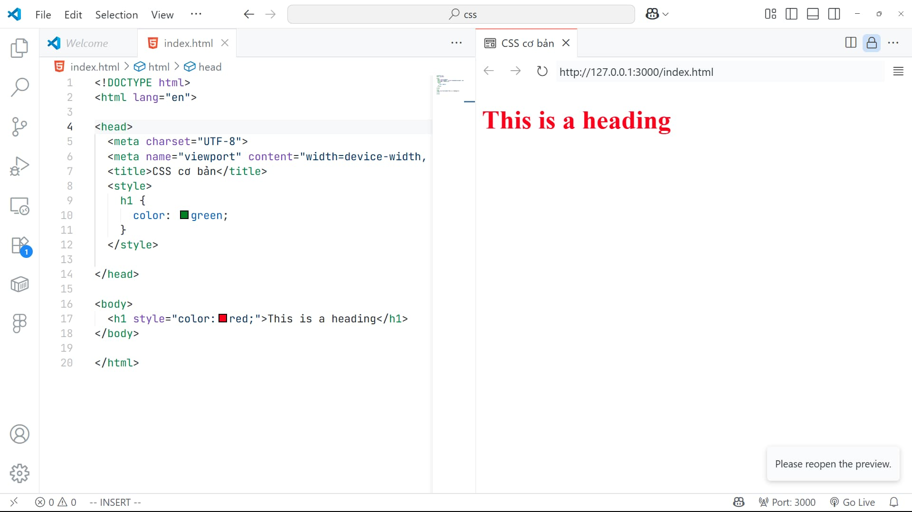

Chào các bạn,

Hôm nay, chúng ta sẽ cùng nhau khám phá một chủ đề cực kỳ quan trọng và thú vị trong hành trình xây dựng website: **CSS – Cascading Style Sheets**. Nếu HTML là bộ xương và nội dung của trang web, thì CSS chính là lớp áo, là màu sắc, là tất cả những gì làm cho trang web của chúng ta trở nên sống động và thu hút.

## CSS là gì và tại sao chúng ta cần đến nó?

Đầu tiên, hãy cùng nhau giải đáp thắc mắc cơ bản nhất: **CSS là gì?** CSS là viết tắt của cụm từ **Cascading Style Sheets**. Về bản chất, nó là một ngôn ngữ được thiết kế để **mô tả cách các phần tử HTML sẽ hiển thị** trên các phương tiện khác nhau như màn hình máy tính, trang in, hoặc các thiết bị khác.

Vậy, **tại sao lại cần đến CSS?** Hãy tưởng tượng bạn có hàng trăm trang HTML và muốn thay đổi màu nền của tất cả chúng. Nếu không có CSS, bạn sẽ phải vào từng trang một và chỉnh sửa thủ công, tốn rất nhiều thời gian và công sức đúng không? CSS ra đời để giải quyết vấn đề này! **Nó giúp chúng ta tiết kiệm rất nhiều công sức**, cho phép **chỉnh sửa giao diện của nhiều trang web cùng một lúc** một cách dễ dàng. Các mô tả CSS thậm chí còn có thể được lưu trữ trong các tệp tin `.css` riêng biệt, giúp việc quản lý trở nên gọn gàng hơn.

## Làm thế nào để "nhúng" CSS vào trang web của bạn?

Đây là một trong những kiến thức cơ bản bạn cần nắm vững: **cách kết nối CSS với tài liệu HTML của mình**. Có ba phương pháp chính để nhúng CSS vào trang web:

*   **Khai báo trực tiếp ở thẻ HTML (Inline style):** Bạn sẽ viết mã CSS ngay bên trong thuộc tính `style` của một thẻ HTML cụ thể. Ví dụ, để đặt màu chữ cho một tiêu đề là màu xanh và căn lề trái 30px, bạn có thể viết `<h1 style="color:blue;margin-left:30px;">This is a heading</h1>`. Phương pháp này hữu ích cho các thay đổi nhỏ, cụ thể.
*   **Khai báo trong thẻ `<style>` của tài liệu HTML (Internal style sheet):** Bạn đặt các quy tắc CSS vào bên trong thẻ `<style>` nằm trong phần `<head>` của tài liệu HTML. Cách này phù hợp khi bạn muốn áp dụng các kiểu cho một trang HTML cụ thể. Ví dụ:
    ```html
    <head>
      <style>
        body { background-color: linen; }
        h1 { color: maroon; margin-left: 40px; }
      </style>
    </head>
    ```
*   **Khai báo trong file .css riêng biệt (External style sheet):** Đây là phương pháp được khuyến khích nhất cho các dự án lớn. Bạn tạo một tệp tin CSS riêng biệt (ví dụ: `mystyle.css`) và liên kết nó với tài liệu HTML bằng thẻ `<link>` trong phần `<head>`. Ví dụ: `<link rel="stylesheet" type="text/css" href="mystyle.css">`. Phương pháp này giúp tái sử dụng mã CSS trên nhiều trang và quản lý code hiệu quả hơn.

## Độ ưu tiên khi nhúng CSS – Quy tắc "Thác nước" (Cascading)

Một điểm đặc biệt của CSS là tính "Cascading" (thác nước), tức là khi có nhiều khai báo CSS áp dụng cho cùng một thẻ HTML, chúng sẽ tuân theo một **độ ưu tiên nhất định**:

1.  **Inline style** có độ ưu tiên cao nhất.
2.  Tiếp theo là **External và Internal Style** (có cùng độ ưu tiên).
3.  Cuối cùng là **kiểu mặc định của trình duyệt**.

Điều này có nghĩa là nếu bạn có một thẻ `<h1>` với `inline style` màu đỏ, nhưng trong `internal style` lại định nghĩa `h1` màu xanh lá cây, thì màu đỏ sẽ được áp dụng vì `inline style` có độ ưu tiên cao hơn.

```html
<head>
  <style> h1{ color:green; } </style>
</head>
<body>
  <h1 style="color:red;">This is a heading</h1>
</body>
```



Trong ví dụ này, `This is a heading` sẽ hiển thị màu đỏ.

## Cú pháp cơ bản của CSS

Một **Bộ Quy tắc (rule) CSS** luôn bao gồm hai phần chính: một **bộ chọn (selector)** và một **khối khai báo các thuộc tính**.

*   **Bộ chọn (selector):** Là phần chỉ ra (chọn) phần tử HTML mà bạn muốn áp dụng kiểu.
*   **Khối khai báo các thuộc tính:** Nằm trong dấu ngoặc nhọn `{}` và chứa một hoặc nhiều cặp `thuộc tính: giá trị;`.

Ví dụ:
```css
p {
  color: red;
  text-align: center;
}
```
Ở đây, `p` là bộ chọn, và `{ color: red; text-align: center; }` là khối khai báo, trong đó `color` và `text-align` là thuộc tính, `red` và `center` là giá trị.

## Các loại bộ chọn (selector) quan trọng

Để áp dụng kiểu CSS một cách chính xác, chúng ta cần biết các loại bộ chọn khác nhau:

*   **Tag selector (Bộ chọn thẻ):** Chọn tất cả các phần tử HTML có cùng một tên thẻ. Ví dụ: `p { text-align: center; color: red; }` sẽ áp dụng cho tất cả các thẻ `<p>`.
*   **Id selector (Bộ chọn ID):** Chọn **một phần tử duy nhất** với thuộc tính `id` xác định. ID phải là duy nhất trên một trang HTML. Ví dụ: `#para { text-align: center; color: red; }` sẽ áp dụng cho phần tử có `id="para"`.
*   **Class selector (Bộ chọn Class):** Chọn **tất cả các phần tử** có thuộc tính `class` xác định. Một class có thể được sử dụng cho nhiều phần tử. Ví dụ: `.center { text-align: center; color: red; }` sẽ áp dụng cho tất cả các phần tử có `class="center"`.

## Độ ưu tiên của các Selector

Tương tự như cách nhúng CSS, các bộ chọn cũng có độ ưu tiên riêng khi áp dụng cho cùng một thành phần:

1.  **Id selector** có độ ưu tiên cao nhất.
2.  Tiếp theo là **Class selector**.
3.  Cuối cùng là **Tag selector**.

Điều này có nghĩa là nếu một thẻ `<h1>` có cả `id` và `class` và được định nghĩa kiểu cho cả ba loại selector này, thì kiểu của `id` sẽ được áp dụng.

Ví dụ:
```css
#header {
  text-align: center;
  color: red;
}
.my-header {
  text-align: center;
  color: yellow;
}
h1 {
  text-align: center;
  color: green;
}
```
Với HTML: `<h1 id="header" class="my-header">Hello World!</h1>`
Kết quả là `Hello World!` sẽ có màu **đỏ** vì `#header` có độ ưu tiên cao nhất.

Bạn cũng có thể **kết hợp nhiều bộ chọn** lại với nhau trong cùng một khai báo để áp dụng cùng một tập hợp các thuộc tính cho nhiều phần tử. Ví dụ: `h1, h2, p { text-align: center; color: red; }` sẽ áp dụng căn giữa và màu đỏ cho tất cả các thẻ `<h1>`, `<h2>`, và `<p>`.

## Một số thuộc tính định dạng văn bản cơ bản trong CSS

CSS cung cấp rất nhiều thuộc tính để bạn tùy chỉnh văn bản trên trang web của mình. Dưới đây là một số thuộc tính phổ biến nhất:

*   `color`: Quy định **màu sắc chữ**.
*   `text-align`: Dùng để **căn lề chữ** sang trái/phải, hoặc giữa.
*   `text-decoration`: Dùng để **trang trí chữ** như gạch chân, gạch giữa.
*   `text-transformation`: Chuyển đổi văn bản thành **chữ hoa/chữ thường**.
*   `font-family`: Quy định **loại chữ** (font) như Arial, Times New Roman.
*   `font-style`: Đặt **kiểu chữ** như in nghiêng, in đậm.
*   `font-size`: Điều chỉnh **kích thước chữ**.
*   `font-weight`: Quy định **độ đậm của nét chữ**.

## Lời kết và Mục tiêu tiếp theo

Qua bài này, hy vọng các bạn đã nắm được những kiến thức cơ bản về CSS: từ việc hiểu CSS là gì, tại sao nó quan trọng, đến cách nhúng CSS vào trang web, cú pháp cơ bản, các loại selector và độ ưu tiên của chúng, cũng như một số thuộc tính định dạng văn bản.

Mục tiêu của chúng ta là các bạn có thể **nhúng được CSS vào trang web**, **sử dụng được CSS selector**, và **sử dụng được CSS để tùy chỉnh văn bản**.

Hãy thực hành thật nhiều với các kiến thức này nhé! Trong bài tiếp theo, chúng ta sẽ đi sâu hơn vào **Box Model** và cách sử dụng CSS để **điều chỉnh kích thước các thành phần** và **tạo layout đơn giản** cho trang web.

Chúc các bạn học tốt!
