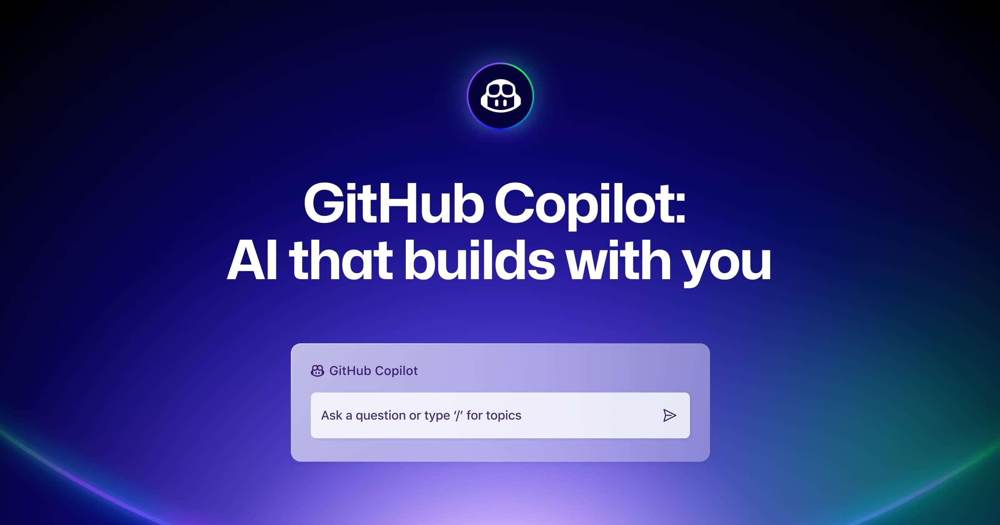

Chào các bạn mới bước chân vào thế giới lập trình! Chắc hẳn trong quá trình làm quen với những dòng code đầu tiên, đôi khi các bạn sẽ cảm thấy bối rối trước những đoạn mã phức tạp hoặc mất khá nhiều thời gian để tìm kiếm giải pháp cho một vấn đề nào đó. Nếu bạn đang sử dụng **Visual Studio Code (VS Code)** hoặc các IDE mạnh mẽ của **JetBrains** như **WebStorm**, thì có một công cụ rất thú vị có thể trở thành người bạn đồng hành đắc lực của bạn: **GitHub Copilot**.

Bài viết này sẽ giới thiệu về GitHub Copilot và cách nó có thể giúp những người mới học lập trình như các bạn nâng cao hiệu quả công việc một cách chuyên nghiệp và thân thiện.

## GitHub Copilot là gì?

**GitHub Copilot** là một **công cụ lập trình đồng hành thông minh dựa trên trí tuệ nhân tạo (AI)**, được phát triển bởi GitHub và OpenAI. Nó hoạt động như một "lập trình viên cặp đôi" ảo, có khả năng **đưa ra các gợi ý mã ngay trong trình soạn thảo của bạn**. Sử dụng công nghệ **OpenAI Codex**, Copilot có thể chuyển đổi ngôn ngữ tự nhiên thành mã và tạo ra các gợi ý liên quan đến những gì bạn đang viết.

Bạn có thể nhận được gợi ý cho **cả dòng mã đơn lẻ, các hàm hoàn chỉnh, hoặc thậm chí cả một khối code lớn hơn**. Điều đặc biệt là GitHub Copilot hỗ trợ **rất nhiều ngôn ngữ lập trình và framework** phổ biến như Python, JavaScript, TypeScript, Ruby, Go, C#, và nhiều hơn nữa.

Tuy nhiên, điều quan trọng cần nhớ là **GitHub Copilot không phải là một công cụ "thần kỳ" có thể viết toàn bộ code thay bạn**. Nó là một trợ lý, và bạn vẫn cần phải **hiểu, điều chỉnh và kiểm tra** các gợi ý để đảm bảo tính chính xác và hiệu suất của mã.

## Bắt đầu sử dụng GitHub Copilot trong VS Code và WebStorm

Việc cài đặt và sử dụng GitHub Copilot khá đơn giản, đặc biệt nếu bạn đã quen thuộc với VS Code và các IDE của JetBrains.

### Đối với Visual Studio Code

**Bước 1: Cài đặt các tiện ích mở rộng GitHub Copilot**.

- Mở VS Code, chuyển đến mục **Extensions** (biểu tượng các ô vuông).
- Tìm kiếm "[GitHub Copilot](https://marketplace.visualstudio.com/items/?itemName=GitHub.copilot)" và cài đặt tiện ích này.
- Tiếp tục tìm kiếm và cài đặt "[GitHub Copilot Chat](https://marketplace.visualstudio.com/items?itemName=GitHub.copilot-chat)" để có thể tương tác với Copilot thông qua cửa sổ chat.

**Bước 2: Đăng nhập vào tài khoản GitHub**.

- Sau khi cài đặt, bạn sẽ thấy biểu tượng GitHub Copilot ở góc dưới bên phải màn hình. Nhấn vào đó và chọn "**Sign In**".
- Một cửa sổ trình duyệt sẽ mở ra, yêu cầu bạn **ủy quyền (Authorize)** cho Visual Studio Code trên GitHub. Hãy chấp nhận yêu cầu này.

**Bước 3: Bắt đầu dùng thử hoặc chọn gói đăng ký**.

- Thông thường, bạn sẽ có tùy chọn bắt đầu **dùng thử miễn phí trong một khoảng thời gian nhất định** (ví dụ: 30 ngày).
- Nếu bạn là **sinh viên, giáo viên hoặc người duy trì các dự án mã nguồn mở phổ biến**, bạn có thể được **sử dụng miễn phí**.
- Sau thời gian dùng thử, bạn có thể cần đăng ký một gói dịch vụ trả phí nếu muốn tiếp tục sử dụng. Hiện tại, GitHub Copilot có các gói **Free** (với giới hạn số lượng gợi ý và chat) và **Pro** (không giới hạn).

### Đối với IDE WebStorm và các IDE khác của JetBrains (IntelliJ IDEA, PyCharm, v.v.)

**Bước 1: Cài đặt Plugin GitHub Copilot**.

- Mở IDE JetBrains của bạn (ví dụ: WebStorm).
- Vào **Settings/Preferences** (trên macOS là **IntelliJ IDEA/WebStorm** -> **Preferences**).
- Chọn mục **Plugins**.
- Trong tab **Marketplace**, tìm kiếm "**GitHub Copilot**" và nhấn "**Install**". Bạn cũng có thể tìm thấy plugin này trên **JetBrains Marketplace**.

**Bước 2: Khởi động lại IDE**.

**Bước 3: Mở cửa sổ Copilot Chat**.

- Sau khi khởi động lại, bạn sẽ thấy biểu tượng **Copilot Chat** ở phía bên phải cửa sổ IDE. Nhấn vào biểu tượng này để mở cửa sổ chat.

**Bước 4: Kích hoạt và đăng nhập**.

- Nếu bạn chưa có quyền truy cập, hãy nhấp vào liên kết để thử **GitHub Copilot Free plan**.
- Sau khi kích hoạt tài khoản, quay lại IDE và nhấp vào "**Sign in to GitHub**" để tiếp tục.

**Bước 5: Bắt đầu sử dụng**.

- Sau khi đăng nhập, bạn có thể bắt đầu sử dụng đầy đủ các tính năng của GitHub Copilot trong IDE JetBrains của mình.

## Cách sử dụng GitHub Copilot hiệu quả

Khi bạn đã cài đặt và đăng nhập thành công, GitHub Copilot sẽ tự động đưa ra các gợi ý khi bạn bắt đầu gõ code. Dưới đây là một vài cách để tận dụng tối đa sức mạnh của nó:

- **Gợi ý tự động khi gõ:** Chỉ cần bắt đầu gõ code, và Copilot sẽ hiển thị các gợi ý có liên quan bằng **chữ màu xám**. Để chấp nhận gợi ý, bạn thường chỉ cần nhấn phím **Tab**.
- **Gợi ý từ bình luận (comments):** Bạn có thể **mô tả những gì bạn muốn làm bằng ngôn ngữ tự nhiên trong một bình luận**, và Copilot sẽ cố gắng gợi ý code để thực hiện mục tiêu đó. Ví dụ: trong một file HTML, bạn có thể viết `<!-- hãy tạo cho tôi một form đăng nhập với username và password -->` và xem Copilot gợi ý code.
- **Xem các gợi ý khác:** Đôi khi Copilot sẽ đưa ra nhiều hơn một gợi ý. Bạn có thể **di chuột qua gợi ý** để hiển thị các nút điều khiển hoặc sử dụng các **phím tắt** để xem các gợi ý tiếp theo hoặc trước đó.
  - **macOS:** `Option + ]` (tiếp theo), `Option + [` (trước đó).
  - **Windows/Linux:** `Alt + ]` (tiếp theo), `Alt + [` (trước đó).
- **Chấp nhận một phần gợi ý:** Nếu bạn không muốn chấp nhận toàn bộ gợi ý, bạn có thể **chấp nhận từ hoặc dòng tiếp theo**. Di chuột qua gợi ý và chọn "**Accept Word**" hoặc thiết lập phím tắt cho "**Accept Next Line**".
- **Copilot Chat:** Sử dụng cửa sổ chat để **hỏi Copilot về code của bạn, yêu cầu giải thích, hoặc thậm chí bắt đầu một phiên chỉnh sửa** để thêm tính năng mới hoặc sửa lỗi. Trong JetBrains, tính năng **Copilot Edits** cho phép bạn thực hiện các thay đổi trên nhiều tệp trực tiếp từ Copilot Chat.

## Lợi ích khi sử dụng GitHub Copilot cho người mới học lập trình

GitHub Copilot mang lại nhiều lợi ích thiết thực cho những người mới học lập trình:

- **Tăng hiệu suất:** Copilot có thể gợi ý code nhanh chóng, giúp bạn **viết code nhanh hơn và tiết kiệm thời gian**.
- **Hỗ trợ đa dạng ngôn ngữ và framework:** Dù bạn đang học Python, JavaScript cho web, hay bất kỳ ngôn ngữ nào khác được hỗ trợ, Copilot đều có thể giúp bạn.
- **Học hỏi các kỹ thuật mới:** Copilot có thể gợi ý những cách viết code mà bạn có thể chưa biết, giúp bạn **học hỏi các kỹ thuật, phong cách lập trình và thậm chí cả các framework mới**.
- **Tích hợp dễ dàng:** Việc tích hợp vào VS Code và các IDE JetBrains rất mượt mà, không làm gián đoạn quy trình làm việc quen thuộc của bạn.
- **Gợi ý có ngữ cảnh:** Copilot cố gắng hiểu ngữ cảnh code bạn đang viết để đưa ra các gợi ý phù hợp nhất.

## Những điều cần lưu ý (Cảnh báo cho người mới bắt đầu)

Mặc dù GitHub Copilot rất hữu ích, nhưng bạn cũng cần lưu ý một vài điểm sau:

- **Chi phí duy trì:** Sau thời gian dùng thử miễn phí, bạn có thể cần trả phí để tiếp tục sử dụng. Hãy cân nhắc gói **Free** nếu bạn không có nhu cầu sử dụng quá nhiều.
- **Độ chính xác không tuyệt đối:** Các gợi ý từ AI đôi khi có thể **không chính xác hoặc không hoàn toàn phù hợp** với yêu cầu của bạn. Hãy luôn **kiểm tra và hiểu rõ** code mà Copilot gợi ý trước khi sử dụng.
- **Khả năng hiểu ngữ cảnh hạn chế:** Đối với những yêu cầu phức tạp hoặc ngữ cảnh quá rộng, Copilot có thể gặp khó khăn trong việc đưa ra gợi ý chính xác.
- **Phụ thuộc vào kết nối Internet:** Để hoạt động, GitHub Copilot cần kết nối Internet ổn định.
- **Vấn đề bảo mật và quyền riêng tư:** Khi sử dụng Copilot, đặc biệt trong môi trường làm việc nhạy cảm, hãy lưu ý đến các vấn đề liên quan đến bảo mật và quyền riêng tư. GitHub cam kết không sử dụng dữ liệu Copilot Business hoặc Enterprise để huấn luyện mô hình AI của họ.

## Kết luận

**GitHub Copilot là một trợ lý lập trình AI mạnh mẽ và đầy tiềm năng** có thể giúp những người mới học lập trình như bạn **viết code nhanh hơn, học hỏi được nhiều điều mới và tự tin hơn** trong hành trình chinh phục thế giới lập trình. Với khả năng tích hợp mượt mà vào VS Code và các IDE JetBrains mà bạn đã quen thuộc, việc khám phá và tận dụng sức mạnh của Copilot chắc chắn sẽ mang lại những trải nghiệm thú vị và hiệu quả bất ngờ.

Hãy thử cài đặt và trải nghiệm GitHub Copilot ngay hôm nay để cảm nhận sự khác biệt! Chúc các bạn thành công trên con đường trở thành những nhà phát triển tài năng!
