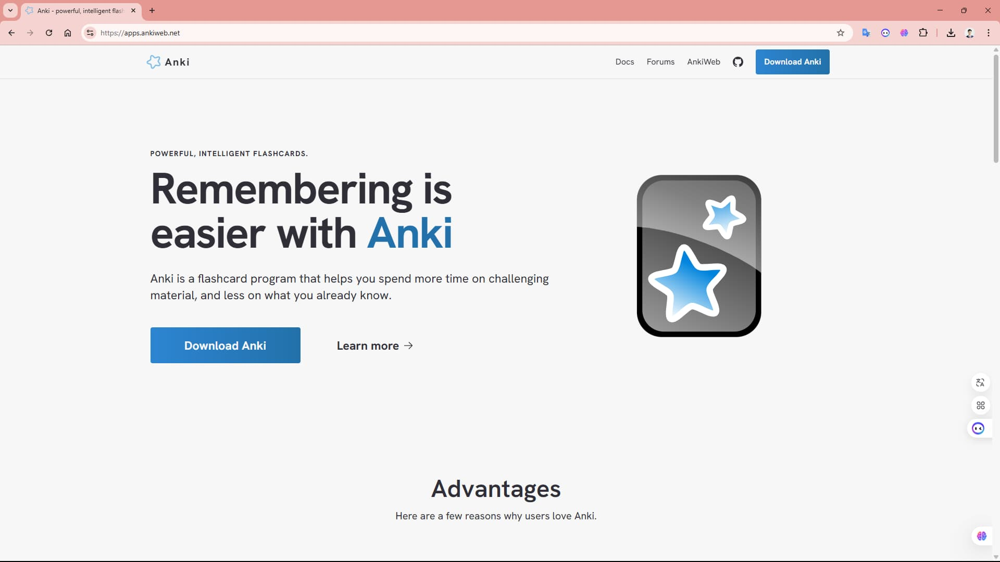

Bạn có từng học một khái niệm JavaScript, cảm thấy hiểu rõ, nhưng chỉ vài tuần sau đã quên mất? Đó là điều bình thường của bộ não. Là giảng viên dạy frontend JavaScript, tôi đã chứng kiến nhiều học viên gặp khó khăn trong việc ghi nhớ lâu dài. May mắn thay, **kỹ thuật lặp lại ngắt quãng** kết hợp với ứng dụng **Anki** có thể giúp bạn khắc phục vấn đề này. Hãy cùng khám phá cách áp dụng kỹ thuật này để nắm vững JavaScript nhé!

## Kỹ thuật lặp lại ngắt quãng là gì?

Kỹ thuật lặp lại ngắt quãng (spaced repetition) là phương pháp ôn tập kiến thức vào đúng thời điểm bạn sắp quên, giúp lưu giữ thông tin lâu dài. Thay vì học dồn dập, bạn sẽ ôn lại theo các khoảng thời gian tăng dần, sử dụng công cụ như Anki để tối ưu hóa lịch trình.

Nguyên tắc cơ bản:

- **Ôn tập đều đặn**: Học và ôn lại kiến thức theo lịch trình khoa học.
- **Tăng khoảng cách ôn tập**: Từ vài phút, vài giờ, đến vài ngày, vài tuần.
- **Tập trung vào điểm yếu**: Dành thời gian cho những khái niệm bạn hay quên.

Ví dụ: Bạn học 10 khái niệm JavaScript mới. Đây là cách ôn tập:

- **Ngày 1**: Ôn sau 15 phút, rồi ôn lại trước khi đi ngủ.
- **Ngày 2**: Ôn vào buổi sáng.
- **Ngày 4, 7, 14**: Ôn lại với khoảng cách dài hơn nếu bạn nhớ tốt.

## Tại sao kỹ thuật này hiệu quả với JavaScript?

Học JavaScript đòi hỏi ghi nhớ nhiều khái niệm như biến, hàm, hay OOP. Kỹ thuật lặp lại ngắt quãng với Anki giúp:

- **Củng cố trí nhớ dài hạn**: Chuyển kiến thức từ trí nhớ ngắn hạn sang dài hạn.
- **Tiết kiệm thời gian**: Anki tự động nhắc bạn ôn những gì cần thiết.
- **Tăng tự tin khi code**: Nhớ vững kiến thức giúp bạn viết code nhanh và chính xác.

## Cách áp dụng kỹ thuật lặp lại ngắt quãng với Anki

Dưới đây là hướng dẫn chi tiết để bạn sử dụng kỹ thuật này với Anki khi học JavaScript:

### Bước 1: Chia nhỏ kiến thức JavaScript

Hãy chia các chủ đề JavaScript thành những đơn vị nhỏ, dễ học và ôn tập. Một số gợi ý:

- **Biến**: let, const, var, scope.
- **Kiểu dữ liệu**: Number, String, Boolean, Null, Undefined, Symbol, BigInt.
- **Toán tử**: Toán tử số học, so sánh, logic.
- **Cấu trúc điều kiện**: if, else, switch.
- **Vòng lặp**: for, while, do...while.
- **Mảng**: Tạo mảng, các phương thức như push, pop, map.
- **Hàm**: Khai báo hàm, tham số, giá trị trả về.
- **OOP**: Object literals, constructor functions, classes.

### Bước 2: Tạo flashcard trong Anki

Anki là công cụ tuyệt vời để quản lý flashcard và tự động lên lịch ôn tập. Cách tạo flashcard:

- **Tạo bộ thẻ (deck)**: Tạo một deck trong Anki có tên như “JavaScript Cơ Bản”.
- **Thêm flashcard**: Mỗi flashcard có mặt trước (câu hỏi/khái niệm) và mặt sau (câu trả lời/giải thích).
- **Tùy chỉnh lịch ôn tập**: Anki sẽ tự động nhắc bạn ôn lại dựa trên mức độ ghi nhớ.

**Ví dụ flashcard JavaScript**:

- Mặt trước: “Kết quả của typeof null là gì?”  
  Mặt sau: “object (lỗi lịch sử trong JavaScript).”
- Mặt trước: “Viết cú pháp khai báo biến const.”  
  Mặt sau: `const tenBien = giaTri;`
- Mặt trước: “Phương thức mảng nào thêm phần tử vào cuối mảng?”  
  Mặt sau: “push()”

### Bước 3: Ôn tập theo lịch trình Anki

- **Lần ôn đầu tiên**: Ôn lại ngay sau khi học (khoảng 15-20 phút).
- **Các lần tiếp theo**: Anki sẽ tự động hiển thị flashcard theo mức độ bạn nhớ. Nếu nhớ tốt, khoảng cách ôn sẽ dài hơn (1 ngày, 3 ngày, 1 tuần...). Nếu quên, Anki sẽ nhắc ôn sớm hơn.
- **Mẹo**: Dành 10-15 phút mỗi ngày để ôn flashcard trên Anki. Ứng dụng có sẵn trên điện thoại, giúp bạn học mọi lúc, mọi nơi.

## Lợi ích khi dùng Anki với kỹ thuật lặp lại ngắt quãng

Tôi đã thấy nhiều học viên cải thiện rõ rệt khi dùng Anki để học JavaScript. Một số lợi ích:

- **Nhớ lâu hơn**: Các khái niệm như kiểu dữ liệu hay vòng lặp trở nên “khó quên”.
- **Học hiệu quả hơn**: Anki giúp bạn tập trung vào những gì cần ôn.
- **Áp dụng thực tế tốt hơn**: Nắm vững kiến thức giúp bạn tự tin khi làm dự án thực tế.

## Bắt đầu với Anki ngay hôm nay!

Kỹ thuật lặp lại ngắt quãng với Anki là công cụ mạnh mẽ để học JavaScript hiệu quả. Hãy thử bắt đầu với một chủ đề nhỏ, như biến hoặc kiểu dữ liệu, và tạo 5-10 flashcard trong Anki. Chỉ cần 10 phút mỗi ngày, bạn sẽ thấy sự tiến bộ rõ rệt sau vài tuần!

Bạn nghĩ sao về cách học này? Có chủ đề JavaScript nào bạn muốn bắt đầu với Anki không? Hãy chia sẻ, tôi rất sẵn lòng hỗ trợ bạn thiết lập bộ flashcard đầu tiên!
