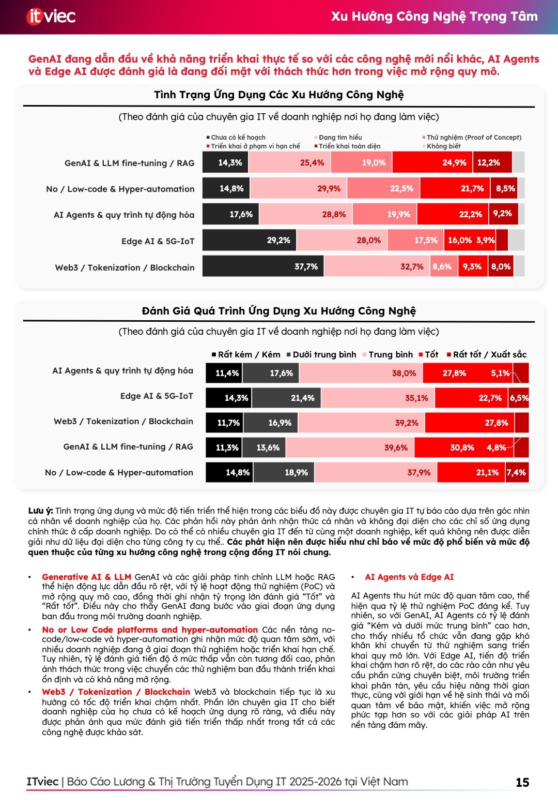

Câu trả lời ngắn gọn là: **Ngành Công nghệ thông tin (IT) tại Việt Nam vẫn có tương lai rất sáng, nhưng đã bước vào một "kỷ nguyên mới" đòi hỏi tư duy khác biệt.**

Không còn là thời điểm mà chỉ cần biết lập trình cơ bản hay hoàn thành một khóa học ngắn hạn là có thể dễ dàng có mức lương nghìn đô. Thị trường hiện nay đang ở giai đoạn **thanh lọc mạnh mẽ** và dịch chuyển sang hướng chọn lọc, chất lượng hơn. Dưới đây là phân tích chi tiết bối cảnh hiện tại dựa trên số liệu thực tế để bạn có cái nhìn bao quát và thực tế nhất.

---

## 1. Bản chất sự thay đổi: Từ "Số lượng" sang "Chất lượng"

Để trả lời cho câu hỏi *ngành công nghệ thông tin có còn tương lai không*, trước hết chúng ta cần nhìn thẳng vào số liệu thực tế về những thay đổi cốt lõi đang diễn ra trong ngành.

Theo dữ liệu khảo sát từ [Báo cáo Lương và Thị trường tuyển dụng IT Việt Nam 2025 - 2026 của ITviec](https://itviec.com/bao-cao/luong-it-va-thi-truong-tuyen-dung-it-vietnam), thị trường IT đang trải qua giai đoạn chuyển tiếp quan trọng:

*   **Sự ổn định về mặt thu nhập:** Xét tổng thể, mức lương IT trung bình hàng tháng ghi nhận mức điều chỉnh giảm nhẹ **1,1%** so với năm trước (đạt khoảng 43,2 triệu VND). Điều này cho thấy thị trường lương đang bước vào giai đoạn đi ngang và ổn định, chấm dứt thời kỳ tăng trưởng nóng thiếu bền vững.
*   **Quy trình sàng lọc đầu vào khắc nghiệt:** Các doanh nghiệp đang kiểm soát cực kỳ chặt chẽ chất lượng tuyển dụng. Dữ liệu từ phễu tuyển dụng cho thấy chỉ có **38,2%** hồ sơ ứng tuyển vượt qua được vòng sàng lọc hồ sơ ban đầu. Điều này phản ánh rõ xu hướng ưu tiên thực lực và sự phù hợp thay vì tuyển dụng đại trà.
*   **Doanh nghiệp ưu tiên nhân sự có thâm niên:** Nhu cầu tuyển dụng tập trung chủ yếu vào nhóm nhân sự trình độ trung và cao cấp, với **76,8%** kế hoạch tuyển dụng dành cho Middle level và **62,2%** dành cho Senior level. Cơ hội cho các bạn junior hời hợt đang thu hẹp lại, đòi hỏi ứng viên phải trang bị năng lực thực chiến cao hơn.

---

## 2. Tại sao IT vẫn là ngành "còn tương lai"?

Dù sự cạnh tranh tăng cao và thị trường đang thanh lọc, ngành IT vẫn được xem là "xương sống" của nền kinh tế số nhờ những nhu cầu bền vững và định hướng quốc gia dài hạn:

### Nhu cầu tuyển dụng cao ở các vị trí cốt lõi
Các doanh nghiệp vẫn liên tục tìm kiếm và củng cố đội ngũ kỹ sư cốt lõi. Trong đó, các vị trí có nhu cầu tuyển dụng cao nhất cho năm 2026 bao gồm:
*   **Full-stack Developer** (chiếm **50,8%** nhu cầu tuyển dụng)
*   **Back-end Developer** (chiếm **47,7%** nhu cầu tuyển dụng)
*   **Front-end Developer** (chiếm **26,2%** nhu cầu tuyển dụng)

Về mặt kỹ thuật, các nhóm chuyên môn về hạ tầng số và đám mây đang dẫn đầu xu hướng tăng cường năng lực của doanh nghiệp, nổi bật là **DevOps & CI/CD** (ưu tiên tuyển dụng của **53,1%** công ty) và **Cloud/Multi-cloud** (chiếm **48,4%**).

### Mức thu nhập và cơ hội thăng tiến hấp dẫn
Đối với những nhân sự có chuyên môn sâu, mức đãi ngộ trong ngành IT vẫn vượt trội hơn hẳn so với nhiều ngành nghề khác. Theo báo cáo của ITviec:
*   Vị trí lãnh đạo công nghệ như **CTO/CIO/VPoE** đạt mức lương trung vị lên tới **101,25 triệu VND/tháng**.
*   Các vai trò dẫn dắt kỹ thuật như **Tech Lead** và **IT Manager** lần lượt đạt **51,8 triệu VND/tháng** và **50,25 triệu VND/tháng**.
*   Các vị trí liên quan đến dữ liệu tiếp tục giữ sức hút lớn, tiêu biểu như **Data Engineer** có thể đạt mức lương trung vị **56,9 triệu VND/tháng** chỉ sau 3-4 năm kinh nghiệm.

### Định hướng chiến lược phát triển dài hạn của Chính phủ (Tầm nhìn 2030 - 2045)
Sự phát triển của ngành IT Việt Nam được định hướng vững chắc bằng các quyết định chiến lược vĩ mô từ Chính phủ, mở ra tiềm năng tăng trưởng khổng lồ trong thập kỷ tới:
*   **Kinh tế số đóng góp lớn vào GDP:** Theo **Quyết định số 411/QĐ-TTg của Thủ tướng Chính phủ** phê duyệt *Chiến lược quốc gia phát triển kinh tế số và xã hội số đến năm 2025, định hướng đến năm 2030*, mục tiêu đề ra là kinh tế số sẽ đóng góp tới **30% GDP** của Việt Nam vào năm 2030. Đây là bàn đạp quan trọng để đưa Việt Nam trở thành quốc gia phát triển có thu nhập cao vào năm 2045.
*   **Khát vọng 300 tỷ USD doanh thu công nghệ số:** **Quyết định số 840/QĐ-TTg** phê duyệt *Chương trình phát triển công nghiệp công nghệ số giai đoạn 2026-2030, tầm nhìn đến năm 2045* đã đặt mục tiêu doanh thu ngành công nghiệp công nghệ số tối thiểu đạt **300 tỷ USD** vào năm 2030. Tầm nhìn 2045 là đưa Việt Nam trở thành trung tâm công nghiệp công nghệ số hàng đầu thế giới.
*   **Phát triển 3 triệu nhân lực công nghệ:** Cũng theo Quyết định 840/QĐ-TTg, nước ta hướng tới phát triển đội ngũ trên **3 triệu nhân lực công nghiệp công nghệ số** và hình thành **100.000 doanh nghiệp công nghệ số** vào năm 2030.
*   **Vươn ra thị trường toàn cầu:** **Quyết định số 982/QĐ-TTg** phê duyệt *Đề án hỗ trợ doanh nghiệp công nghệ số vươn ra toàn cầu* đặt đích tối thiểu **5.000 doanh nghiệp công nghệ số** có doanh thu từ thị trường quốc tế vào năm 2030, nâng cao vị thế và thương hiệu sản phẩm "Make in Viet Nam".

---

## 3. Bạn cần chuẩn bị gì để không bị đào thải trong kỷ nguyên mới?

Để "sống sót" và bứt phá trong bối cảnh thị trường IT mới, bạn cần dịch chuyển kỹ năng và tư duy theo các tiêu chí đánh giá thực tế của nhà tuyển dụng:

### Chuyển từ "Coder" sang "Problem Solver" (Người giải quyết vấn đề)

Kỹ năng viết mã (coding) đơn thuần không còn là tấm vé bảo hiểm cho sự nghiệp của bạn. Doanh nghiệp hiện nay đang ưu tiên những kỹ sư có khả năng giải quyết vấn đề thực tế:
*   **44,6%** doanh nghiệp đánh giá **khả năng giải quyết vấn đề trong các tình huống kỹ thuật thực tế** là yếu tố quan trọng hàng đầu khi tuyển dụng.
*   **43,4%** nhà tuyển dụng đề cao **tư duy thích ứng & sẵn sàng học hỏi công nghệ mới**.
*   Trong khi đó, năng lực kỹ thuật thực tế thuần túy (chỉ làm theo hướng dẫn) chỉ xếp thứ tư với **37,3%** sự lựa chọn.

### Làm chủ các công cụ hỗ trợ AI (AI-Assisted Development)
AI không còn là xu hướng tương lai mà đã trở thành công cụ sinh tồn hàng ngày:
*   **73%** doanh nghiệp tại Việt Nam hiện đang ứng dụng AI vào quy trình vận hành.
*   **96,8%** chuyên gia IT cho biết họ sử dụng AI hằng ngày trong công việc, và **94,2%** thừa nhận AI giúp cải thiện hiệu suất làm việc rõ rệt.
*   Các trường hợp sử dụng AI phổ biến nhất là: đề xuất & hoàn thiện code (**58,6%**), tạo tài liệu kỹ thuật/FAQ (**58,5%**), cải tiến/tái cấu trúc code (**51,5%**), và gỡ lỗi/debug (**51,0%**).

Lập trình viên biết cách sử dụng AI (như GitHub Copilot, Cursor AI) để tối ưu hóa tốc độ và chất lượng công việc sẽ có giá trị vượt trội so với những người từ chối thích nghi.

### Nâng cao kỹ năng bổ trợ (Ngoại ngữ & Kỹ năng mềm)
Bên cạnh chuyên môn kỹ thuật, kỹ năng giao tiếp và làm việc nhóm là cầu nối giúp lập trình viên tạo ra giá trị thực tế:
*   Doanh nghiệp đánh giá rất cao các kỹ năng mềm như **làm việc nhóm (52,3%)** và **giao tiếp (49,2%)**.
*   **Tiếng Anh lưu loát** là ưu tiên hàng đầu của **46,2%** doanh nghiệp tuyển dụng. Tuy nhiên, mức độ thành thạo tiếng Anh trung bình của nhân sự IT Việt Nam hiện chỉ đạt **2,7/5 điểm** (với kỹ năng nói và thuyết trình là yếu nhất). Đây chính là cơ hội lớn: nếu bạn có tiếng Anh tốt, bạn lập tức vượt trội hơn phần lớn đối thủ trên thị trường.

---

## Bảng so sánh: IT trong quá khứ vs IT hiện tại & tương lai

| Tiêu chí | Giai đoạn trước đây | Giai đoạn hiện tại & Tương lai |
| :--- | :--- | :--- |
| **Trọng tâm** | Biết viết code cơ bản, biết nhiều ngôn ngữ | Chuyên sâu một mảng, hiểu bản chất hệ thống |
| **Thách thức** | Thiếu hụt nhân lực số lượng lớn | Thiếu hụt chuyên gia và kỹ sư thực chiến |
| **Công cụ làm việc** | IDE truyền thống, Google, StackOverflow | Phát triển với sự hỗ trợ của AI, Cloud-native |
| **Tiêu chí tuyển dụng** | Tập trung vào kỹ năng viết mã (coding) | Tư duy giải quyết vấn đề + Ngoại ngữ + Sử dụng AI |
| **Mức lương trung vị** | Tăng trưởng nóng, khó kiểm soát | Ổn định (đi ngang hoặc điều chỉnh nhẹ ~1.1%) |

---

## Câu hỏi thường gặp (FAQ)

### 1. Học ngành Công nghệ thông tin có khó xin việc không?
Thực tế là **khó xin việc đối với những ai chỉ học lý thuyết suông và có kỹ năng hời hợt**. Dữ liệu từ ITviec chỉ ra rằng doanh nghiệp đang thắt chặt khâu sàng lọc hồ sơ đầu vào (chỉ 38.2% CV được duyệt). Tuy nhiên, đối với những bạn trẻ biết đặt mục tiêu thực hành từ sớm, rèn luyện ngoại ngữ và biết tận dụng AI, thị trường vẫn đang cực kỳ khát nhân lực chất lượng cao với chỉ tiêu phát triển 3 triệu nhân sự công nghệ số của Chính phủ vào năm 2030.

### 2. Trí tuệ nhân tạo (AI) có thay thế hoàn toàn lập trình viên không?
AI sẽ **thay thế những thợ code (coder) chỉ làm công việc viết mã lặp đi lặp lại**. Bằng chứng là **34,3%** doanh nghiệp không mở rộng tuyển dụng do hiệu suất làm việc của đội ngũ cũ đã được cải thiện rõ rệt nhờ AI. Nhưng ngược lại, AI sẽ làm gia tăng đáng kể hiệu suất cho các kỹ sư phần mềm thực thụ - những người làm chủ AI để thiết kế hệ thống, phân tích yêu cầu nghiệp vụ và giải quyết vấn đề.

### 3. Có nên chuyển ngành sang IT ở thời điểm này?
Bạn hoàn toàn có thể chuyển ngành nếu thực sự có đam mê và kiên trì. Tuy nhiên, hãy chuẩn bị tinh thần rằng con đường này sẽ đòi hỏi nỗ lực gấp đôi so với trước đây. Bạn cần học bài bản và hướng tới việc tạo ra sản phẩm thực tế thay vì tin vào những lời hứa hẹn quảng cáo "học 6 tháng lương nghìn đô".

---

## Lời khuyên cuối cùng

Ngành IT vẫn đang và sẽ tiếp tục là một ngành có mức đãi ngộ và cơ hội phát triển tốt bậc nhất tại Việt Nam. Thay vì lo lắng về việc ngành này có còn tương lai hay không, hãy tập trung nâng cao năng lực để trả lời câu hỏi: **"Làm sao để bản thân nằm trong nhóm 20% nhân sự chất lượng cao mà thị trường luôn săn đón?"**

Nếu bạn có bất kỳ thắc mắc nào về lộ trình học lập trình hoặc băn khoăn về hướng đi sắp tới, hãy để lại bình luận ở phía dưới để cùng thảo luận nhé!
