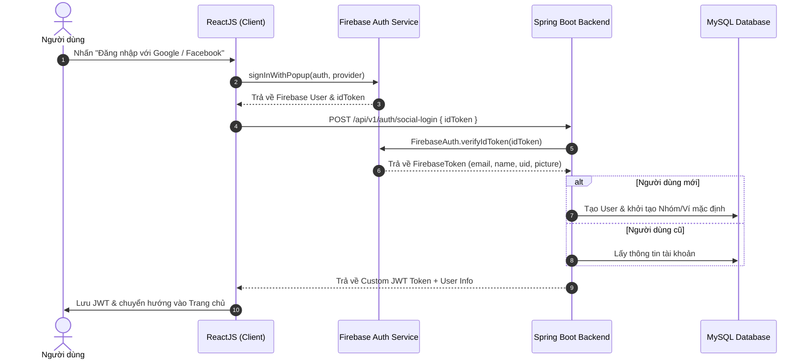

Trong các ứng dụng hiện đại, việc bắt người dùng điền biểu mẫu đăng ký truyền thống thường làm tăng tỷ lệ thoát (drop-off rate). Giải pháp tối ưu là tích hợp **Social Login (Đăng nhập bằng Google, Facebook)**. 

Bài viết này sẽ hướng dẫn bạn mô hình kết hợp cực kỳ an toàn và hiệu quả: **ReactJS sử dụng Firebase Authentication SDK** ở client để lấy `idToken`, sau đó gửi về **Spring Boot REST API** để xác thực qua **Firebase Admin SDK** và phát hành JWT phiên làm việc.

---

## 1. Kiến Trúc Luồng Xác Thực (Authentication Flow)



### Ưu điểm của mô hình này:
1. **Bảo mật cao**: Client không bao giờ lưu trữ Client Secret của Google/Facebook.
2. **Backend kiểm soát tuyệt đối**: Backend xác thực chữ ký token từ Google/Firebase trước khi tạo session, tránh giả mạo danh tính.
3. **Quản lý dữ liệu tập trung**: Tự động liên kết tài khoản mạng xã hội với cơ sở dữ liệu nội bộ (MySQL/PostgreSQL).

---

## 2. Chuẩn Bị Trên Firebase Console

1. Truy cập [Firebase Console](https://console.firebase.google.com/) và tạo một Project mới.
2. Điều hướng tới **Build > Authentication > Sign-in method**.
3. Kích hoạt nhà cung cấp:
   - **Google**: Bật toggle, chọn Email hỗ trợ dự án.
   - **Facebook**: Tạo App trên [Meta for Developers](https://developers.facebook.com/), lấy **App ID** & **App Secret** rồi dán vào Firebase Console.
4. Lấy thông tin cấu hình Client:
   - Vào **Project Settings > General > Your apps**, thêm Web App (`</>`) để lấy `firebaseConfig`.
5. Tạo Private Key cho Backend:
   - Vào **Project Settings > Service accounts > Firebase Admin SDK**, nhấn **Generate new private key** để tải file `firebase-service-account.json`.

---

## 3. Phía Client: ReactJS + Firebase SDK

### 3.1. Cài đặt thư viện
```bash
npm install firebase
```

### 3.2. Cấu hình Firebase (`src/utils/firebase.ts`)
```typescript
import { initializeApp } from 'firebase/app';
import { getAuth, GoogleAuthProvider, FacebookAuthProvider } from 'firebase/auth';

const firebaseConfig = {
  apiKey: import.meta.env.VITE_FIREBASE_API_KEY,
  authDomain: import.meta.env.VITE_FIREBASE_AUTH_DOMAIN,
  projectId: import.meta.env.VITE_FIREBASE_PROJECT_ID,
  storageBucket: import.meta.env.VITE_FIREBASE_STORAGE_BUCKET,
  messagingSenderId: import.meta.env.VITE_FIREBASE_MESSAGING_SENDER_ID,
  appId: import.meta.env.VITE_FIREBASE_APP_ID,
};

const app = initializeApp(firebaseConfig);
export const auth = getAuth(app);
export const googleProvider = new GoogleAuthProvider();
export const facebookProvider = new FacebookAuthProvider();
```

### 3.3. Xử lý Popup Đăng nhập (`src/pages/LoginPage.tsx`)
```tsx
import React, { useState } from 'react';
import { signInWithPopup } from 'firebase/auth';
import { auth, googleProvider, facebookProvider } from '../utils/firebase';
import axios from 'axios';

export const LoginPage: React.FC = () => {
  const [loading, setLoading] = useState(false);

  const handleSocialLogin = async (providerType: 'google' | 'facebook') => {
    setLoading(true);
    try {
      const provider = providerType === 'google' ? googleProvider : facebookProvider;
      
      // 1. Mở popup đăng nhập OAuth2
      const result = await signInWithPopup(auth, provider);
      
      // 2. Lấy Firebase ID Token
      const idToken = await result.user.getIdToken();

      // 3. Gửi Token lên Spring Boot Backend
      const response = await axios.post('/api/v1/auth/social-login', { idToken });
      
      const { token, user } = response.data.data;
      localStorage.setItem('accessToken', token);
      
      alert(`Chào mừng ${user.fullName} đã đăng nhập thành công!`);
      window.location.href = '/dashboard';
    } catch (error: any) {
      console.error('Social Login Error:', error);
      alert(error.response?.data?.message || 'Đăng nhập thất bại!');
    } finally {
      setLoading(false);
    }
  };

  return (
    <div className="login-container">
      <h2>Đăng nhập tài khoản</h2>
      <button 
        disabled={loading} 
        onClick={() => handleSocialLogin('google')}
        className="btn-google"
      >
        Đăng nhập với Google
      </button>

      <button 
        disabled={loading} 
        onClick={() => handleSocialLogin('facebook')}
        className="btn-facebook"
      >
        Đăng nhập với Facebook
      </button>
    </div>
  );
};
```

---

## 4. Phía Server: Spring Boot Backend

### 4.1. Khai báo Dependency (`pom.xml`)
```xml
<dependencies>
    <!-- Firebase Admin SDK -->
    <dependency>
        <groupId>com.google.firebase</groupId>
        <artifactId>firebase-admin</artifactId>
        <version>9.2.0</version>
    </dependency>

    <!-- Spring Security & JWT -->
    <dependency>
        <groupId>org.springframework.boot</groupId>
        <artifactId>spring-boot-starter-security</artifactId>
    </dependency>
    <dependency>
        <groupId>io.jsonwebtoken</groupId>
        <artifactId>jjwt-api</artifactId>
        <version>0.12.5</version>
    </dependency>
</dependencies>
```

### 4.2. Khởi tạo Firebase Admin SDK (`FirebaseConfig.java`)
```java
package com.example.auth.config;

import com.google.auth.oauth2.GoogleCredentials;
import com.google.firebase.FirebaseApp;
import com.google.firebase.FirebaseOptions;
import jakarta.annotation.PostConstruct;
import org.springframework.context.annotation.Configuration;
import org.springframework.core.io.ClassPathResource;

import java.io.InputStream;

@Configuration
public class FirebaseConfig {

    @PostConstruct
    public void initialize() {
        try {
            if (FirebaseApp.getApps().isEmpty()) {
                InputStream serviceAccount = new ClassPathResource("firebase-service-account.json").getInputStream();

                FirebaseOptions options = FirebaseOptions.builder()
                        .setCredentials(GoogleCredentials.fromStream(serviceAccount))
                        .build();

                FirebaseApp.initializeApp(options);
            }
        } catch (Exception e) {
            e.printStackTrace();
        }
    }
}
```

### 4.3. Controller & Service Xác Thực
```java
@RestController
@RequestMapping("/api/v1/auth")
@RequiredArgsConstructor
public class AuthController {

    private final AuthService authService;

    @PostMapping("/social-login")
    public ResponseEntity<ApiResponse<LoginResponse>> socialLogin(@RequestBody SocialLoginRequest request) {
        LoginResponse response = authService.socialLogin(request.getIdToken());
        return ResponseEntity.ok(ApiResponse.success("Đăng nhập thành công", response));
    }
}
```

```java
@Service
@RequiredArgsConstructor
@Slf4j
public class AuthServiceImpl implements AuthService {

    private final UserRepository userRepository;
    private final JwtTokenProvider jwtTokenProvider;

    @Override
    @Transactional
    public LoginResponse socialLogin(String idToken) {
        try {
            // 1. Xác thực ID Token từ Google/Firebase
            FirebaseToken decodedToken = FirebaseAuth.getInstance().verifyIdToken(idToken);
            String email = decodedToken.getEmail();
            String name = decodedToken.getName();
            String picture = decodedToken.getPicture();
            String uid = decodedToken.getUid();

            if (email == null || email.isBlank()) {
                throw new IllegalArgumentException("Không thể xác thực email từ tài khoản mạng xã hội.");
            }

            // 2. Tìm hoặc tự động khởi tạo User mới (Auto-provisioning)
            User user = userRepository.findByEmail(email).orElseGet(() -> {
                User newUser = User.builder()
                        .username(email.split("@")[0] + "_" + UUID.randomUUID().toString().substring(0, 5))
                        .fullName(name != null ? name : "Social User")
                        .email(email)
                        .avatarUrl(picture)
                        .status("ACTIVE")
                        .role(Role.USER)
                        .providerId(uid)
                        .build();
                return userRepository.save(newUser);
            });

            // 3. Tạo JWT Token của hệ thống
            String appJwtToken = jwtTokenProvider.generateToken(user.getUsername());

            return new LoginResponse(appJwtToken, user);
        } catch (FirebaseAuthException e) {
            log.error("Firebase verify token failed: {}", e.getMessage());
            throw new BadCredentialsException("Token xác thực mạng xã hội không hợp lệ");
        }
    }
}
```

---

## 5. Các Lưu Ý Về Mặt Bảo Mật & Best Practices

1. **Không bỏ qua bước Verify Token**: Tuyệt đối không gửi raw `email` hoặc `user_id` từ client lên backend mà không qua `FirebaseAuth.getInstance().verifyIdToken(idToken)`.
2. **CORS Configuration**: Giới hạn domain gọi API trong `WebSecurityConfig` để tránh CSRF / Cross-origin token injection.
3. **Auto-linking Account**: Nếu người dùng đã từng đăng ký bằng Email/Password trước đó, khi họ chọn Đăng nhập Google có cùng Email, hãy tự động map tài khoản để tạo trải nghiệm liền mạch.
