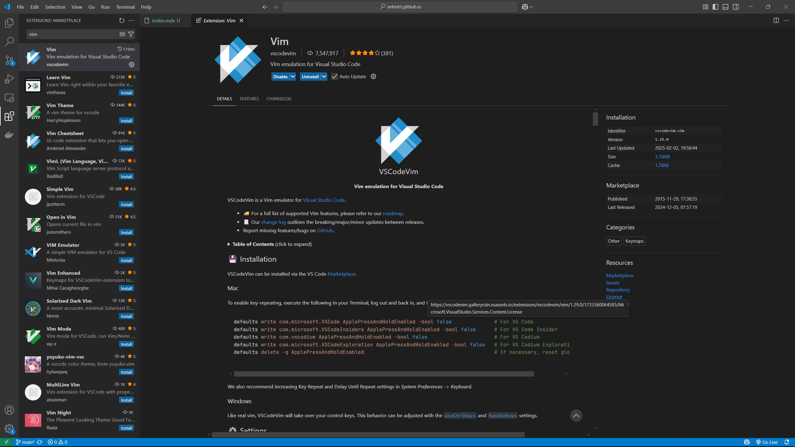
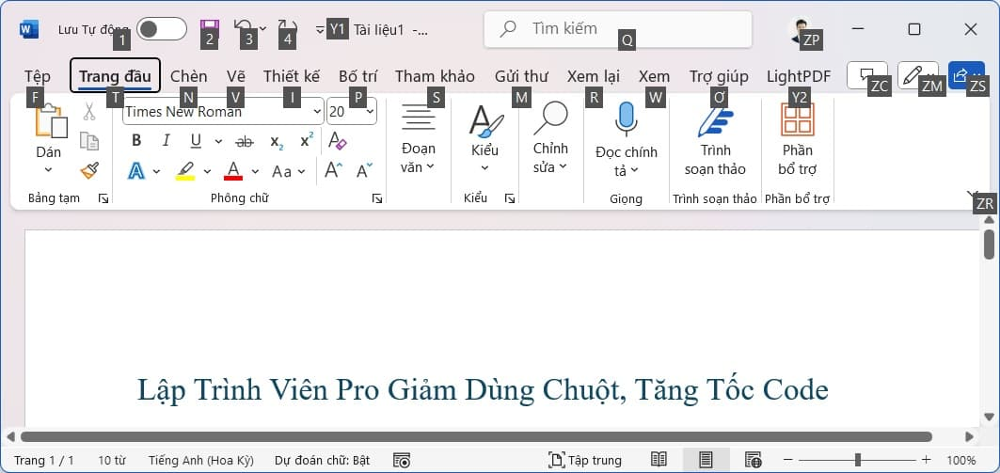

_Originally inspired by [Jeff Atwood's blog post](https://blog.codinghorror.com/going-commando-put-down-the-mouse/)_

Bạn có đang cảm thấy mệt mỏi vì tay cứ phải "phiêu lưu" giữa bàn phím và chuột khi đang code? Đã đến lúc thay đổi! Hãy thử **"Put Down The Mouse"** – tạm biệt con chuột, làm chủ bàn phím, và code nhanh như một ninja. Đây không chỉ là cách để tăng tốc độ mà còn giúp bạn trở thành một lập trình viên thực dụng, làm việc thông minh hơn, không chỉ chăm chỉ.

Phím tắt luôn nhanh hơn việc rê chuột, nhấp nhấp, chờ đợi. Nhưng nếu bạn cứ bám riết lấy chuột, bạn sẽ không bao giờ khám phá được sức mạnh thực sự của bàn phím. **Thử thách bản thân: mỗi ngày học một phím tắt mới.** Ban đầu có thể hơi chậm, nhưng chẳng bao lâu, bạn sẽ thấy mình lướt phím như bay, tập trung vào logic thay vì... rê chuột.

## Bàn phím là bạn, chuột chỉ là người quen

Chuột không phải kẻ thù – nó là một phát minh tuyệt vời. Nhưng nếu bạn dùng chuột cho mọi thứ, bạn đang tự làm chậm mình. Hãy nghĩ về bàn phím như một con dao Thụy Sĩ: nhỏ gọn, đa năng, xử lý được mọi tình huống. Chuột? Nó giống như cái búa – tốt cho vài việc, nhưng không phải tất cả.

Dưới đây là vài phím tắt đơn giản để bạn bắt đầu:

- **Đăng nhập nhanh**: Dùng **Tab** để chuyển giữa các ô, **Enter** để xác nhận.
- **Mở trình duyệt**: Nhấn **Alt+D** (hoặc **Ctrl+L** trên vài trình duyệt) để nhảy tới thanh địa chỉ, gõ link, rồi **Ctrl+Enter** để mở.
- **Tìm kiếm tức thì**: Nhấn **Ctrl+E** (hoặc **Ctrl+K** trên VS Code) để vào ô tìm kiếm, gõ và **Enter**.
- **Di chuyển con trỏ**: Dùng **mũi tên** để đi từng ký tự, **Ctrl + mũi tên** (hoặc **Cmd + mũi tên** trên Mac) để nhảy qua từ, **Home/End** để tới đầu/cuối dòng.
- **Chọn văn bản**: Giữ **Shift** kết hợp với phím di chuyển để bôi đen.
- **Xóa nhanh**: **Ctrl + Delete/Backspace** để xóa cả từ, **Ctrl+L** để xóa nguyên dòng.
- **Gấp/mở code**: Nhấn **Ctrl+M+M** (trên Visual Studio) để thu gọn hoặc mở rộng khối code.

Mọi IDE, trình duyệt, hay công cụ bạn dùng đều có cả tá phím tắt chờ bạn khám phá. Bí quyết là **dám bỏ chuột** để tìm hiểu chúng.

## Tăng cấp với IDE và công cụ

Một lập trình viên giỏi không chỉ biết code mà còn biết cách biến công cụ thành "cánh tay nối dài". Các IDE như VS Code, IntelliJ IDEA, hay PyCharm đều có **bảng lệnh** (command palette, thường mở bằng **Ctrl+Shift+P**) để bạn chạy mọi lệnh mà không cần chuột. Hãy dành vài phút khám phá phím tắt của IDE bạn đang dùng – chúng như "vũ khí bí mật" giúp tiết kiệm hàng giờ.

Muốn nâng cấp độ ninja? Thử tìm hiểu **Vim**. Vim không chỉ là trình soạn thảo, mà là cả một triết lý làm việc với bàn phím. Nhiều IDE hoặc trình soạn thảo mã nguồn như VS Code có plugin mô phỏng Vim [https://marketplace.visualstudio.com/items?itemName=vscodevim.vim](https://marketplace.visualstudio.com/items?itemName=vscodevim.vim), cho phép bạn điều hướng và chỉnh sửa code mà chẳng cần chạm chuột. Ban đầu, Vim có thể hơi "hack não", nhưng khi quen, bạn sẽ thấy mình như đang "bay" trên bàn phím.

Đừng quên **tùy chỉnh phím tắt** trong IDE để phù hợp với thói quen. Ví dụ, nếu bạn thích phím tắt của IntelliJ nhưng đang dùng VS Code, cứ cấu hình lại cho giống. Công cụ là để phục vụ bạn, không phải ngược lại.

## Thử thách Một ngày không chuột

Hãy thử một ngày làm việc mà không chạm vào chuột. Nghe khó? Đúng là khó thật! Bạn sẽ bị cám dỗ bởi con chuột nằm ngay đó, nhưng hãy kiềm chế. Mỗi khi muốn click, tự hỏi: **"Có phím tắt nào làm được việc này không?"** Google nhanh hoặc mở menu **Help > Keyboard Shortcuts** của IDE, bạn sẽ tìm thấy câu trả lời.

Mẹo nhỏ: Microsoft Word hiển thị danh sách phím tắt khi nhấn **Alt**. Dùng chúng như "bản đồ kho báu" để khám phá.

## Lợi ích dài hạn

Bớt dùng chuột không chỉ giúp bạn code nhanh hơn mà còn tốt cho sức khỏe. Rê chuột liên tục có thể khiến cổ tay mỏi, thậm chí gây đau lâu dài. Bàn phím thì cho phép bạn giữ tay ở vị trí tự nhiên hơn, giảm căng thẳng.

Hơn nữa, khi làm chủ bàn phím, bạn sẽ cảm thấy mình "pro" hơn. Mỗi phím tắt bạn học là một bước tiến để trở thành lập trình viên thực dụng: làm việc thông minh, không chỉ chăm chỉ.

## Bắt đầu ngay hôm nay

Hãy thử thách bản thân: hôm nay, học một phím tắt mới. Ngày mai, thêm một phím nữa. Dần dần, bạn sẽ ít phụ thuộc vào chuột, code nhanh hơn, và cảm thấy "ngầu" hơn khi tay lướt phím như bay. Tận dụng IDE, khám phá Vim nếu bạn đủ can đảm, và luôn tìm cách làm việc hiệu quả hơn.
