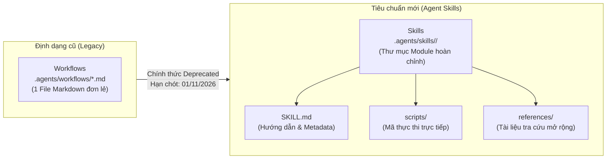
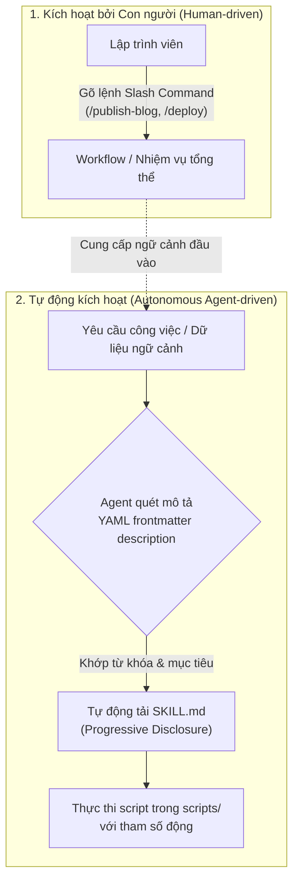
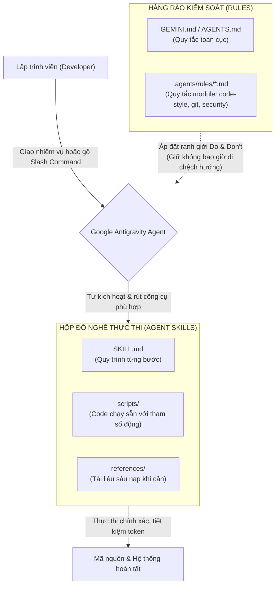
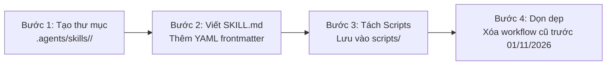

Hiểu rõ sự khác biệt giữa **workflow và skill trong Antigravity** là chìa khóa giúp bạn làm chủ trợ lý AI, thay vì để nó liên tục sinh mã tùy tiện và ngốn hàng nghìn token không cần thiết.

Tối qua trong buổi dạy khóa Vibe Coding, lúc giải thích hai khái niệm Workflow và Skill rồi demo cách tạo chúng trực tiếp trong dự án, mình cứ thấy có gì đó hơi lấn cấn. Thấy dùng cái nào kết quả cuối cùng nó cũng sinh code, cũng sửa file y chang nhau, vậy rốt cuộc tại sao Google Antigravity phải tách ra hai khái niệm cho mất công?

Đêm về xem lại video record buổi học, mình càng thấy phần giải thích của mình lúc đó chưa thực sự thuyết phục và gãy gọn. Thế là mình quyết định lục lại kỹ tài liệu chính thức của Google Antigravity và các bài thực hành trên Google Codelabs để "chữa cháy" một chút. Và câu trả lời bất ngờ nằm ở một thông báo quan trọng: **Workflows thực chất là định dạng cũ (legacy) đã bị phản đối (deprecated) và sẽ chính thức ngừng hoạt động vào ngày 1 tháng 11 năm 2026, nhường chỗ hoàn toàn cho tiêu chuẩn Agent Skills hiện đại hơn**.

Sẵn trải nghiệm làm việc thực chiến hàng ngày với Antigravity và quy trình [Spec-Driven Development (SDD)](/spec-driven-development/), mình viết bài này để làm rõ tường tận bản chất của sự thay đổi này, vai trò của thư mục Rules và lộ trình chuyển đổi tối ưu nhất cho bạn.

> **Tóm tắt cốt lõi (TL;DR):**
> - **Thông báo quan trọng từ Google:** Theo tài liệu chính thức [Migration: Workflows to Skills](https://antigravity.google/docs/migration/workflows-to-skills), **Workflows** là định dạng cũ (chỉ gồm 1 tệp Markdown duy nhất), hiện đã bị **deprecated** và sẽ **ngừng hoạt động hoàn toàn từ ngày 01/11/2026**.
> - **Cùng là tệp `.md` nhưng khác nhau thế nào?** Cả **Workflows cũ** (`workflows/*.md`) và **Rules** (`GEMINI.md`, `.agents/rules/*.md`) đều là các tệp Markdown đơn lẻ. Nhưng Rules đóng vai trò **rào chắn thụ động (Guardrails)** kiểm soát an toàn, còn Skills là một **thư mục đóng gói (Folder/Package)** gồm `SKILL.md` kèm mã thực thi trong `scripts/` để giải quyết triệt để bài toán tự động hóa.
> - **Cơ chế vận hành:** Workflows trước đây do con người gõ lệnh thủ công. Skills thế hệ mới cho phép Agent **tự động kích hoạt thông minh** theo ngữ cảnh (*Progressive Disclosure*), tận dụng script có sẵn với tham số động thay vì bắt AI sinh lại mã từ đầu.

---

## Mục lục bài viết

1. [Bức tranh tổng thể: Sự tiến hóa từ Workflows sang Skills](#1-buc-tranh-tong-the-su-tien-hoa-tu-workflows-sang-skills)
2. [Thông báo quan trọng: Workflows chính thức bị khai tử vào 01/11/2026](#2-thong-bao-quan-trong-workflows-chinh-thuc-bi-khai-tu-vao-01112026)
3. [Khác biệt 1: Cơ chế kích hoạt — Human-in-the-loop vs Autonomous Agent](#3-khac-biet-1-co-che-kich-hoat--human-in-the-loop-vs-autonomous-agent)
4. [Khác biệt 2: Cấu trúc thư mục và kinh tế học Token](#4-khac-biet-2-cau-truc-thu-muc-va-kinh-te-hoc-token)
5. [Khoan đã: Rules trong thư mục .agents/rules cũng là file .md thì sao?](#5-khoan-da-rules-trong-thu-muc-agentsrules-cung-la-file-md-thi-sao)
6. [Bảng so sánh chi tiết: Rules vs Legacy Workflows vs Agent Skills](#6-bang-so-sanh-chi-tiet-rules-vs-legacy-workflows-vs-agent-skills)
7. [Mô hình phối hợp mới: Rules và Skills trong Antigravity](#7-mo-hinh-phoi-hop-moi-rules-va-skills-trong-antigravity)
8. [Hướng dẫn chuyển đổi (Migration Guide): Từ Workflow cũ sang Skill](#8-huong-dan-chuyen-doi-migration-guide-tu-workflow-cu-sang-skill)
9. [Những câu hỏi thường gặp (FAQ)](#9-nhung-cau-hoi-thuong-gap-faq)
10. [Lời kết](#10-loi-ket)

---

## 1. Bức tranh tổng thể: Sự tiến hóa từ Workflows sang Skills

Khi mới tiếp xúc với Google Antigravity, rất nhiều lập trình viên rơi vào cảm giác bối rối: *"Tại sao vừa có Rules, vừa có Workflows, lại vừa có Skills?"*. 

Thực tế, hệ thống tùy biến của Antigravity đã trải qua một giai đoạn chuyển giao kiến trúc quan trọng:

- **Giai đoạn đầu (Legacy Architecture):** Antigravity sử dụng các file `.md` đơn lẻ đặt trong `.agents/workflows/` (hoặc `.agent/workflows/`). Mỗi khi cần chạy một quy trình, lập trình viên gõ Slash Command `/ten-workflow`.
- **Giai đoạn hiện tại (Modern Agentic Standard):** Nhận thấy hạn chế của các file markdown rời rạc, Google đã nâng cấp toàn bộ hệ thống sang **Agent Skills** đặt trong `.agents/skills/<name>/`. Đây không chỉ là một tài liệu hướng dẫn, mà là một gói công cụ độc lập (Modular Package).



---

## 2. Thông báo quan trọng: Workflows chính thức bị khai tử vào 01/11/2026

Nếu bạn hoặc đội ngũ của bạn vẫn đang viết các file quy trình trong thư mục `workflows/`, đây là thông tin bạn cần lưu ý ngay lập tức:

Theo tài liệu di trú chính thức của Google Antigravity ([Migration: Workflows to Skills](https://antigravity.google/docs/migration/workflows-to-skills)):
- **Workflows là tính năng cũ (legacy format):** Chỉ bao gồm một tệp Markdown duy nhất.
- **Trạng thái hiện tại:** Đã chính thức bị phản đối (**Deprecated**).
- **Thời hạn chót (End of Life):** Tính năng Workflows sẽ **chính thức ngừng hoạt động vào ngày 1 tháng 11 năm 2026**.
- **Giải pháp thay thế:** Toàn bộ quy trình phải được chuyển đổi sang tiêu chuẩn **Skills (Agent Skills)**.

Lý do Google đưa ra quyết định này rất rõ ràng: Việc ép toàn bộ logic, code mẫu và quy trình vào một tệp Markdown duy nhất khiến ngữ cảnh (context) bị phình to, agent khó kiểm soát các tác vụ phức tạp và không thể tận dụng lại các script tự động hóa có sẵn.

---

## 3. Khác biệt 1: Cơ chế kích hoạt — Human-in-the-loop vs Autonomous Agent

Sự khác biệt rõ nét nhất trong trải nghiệm hàng ngày nằm ở việc **ai là người bấm nút khởi động**:

### Workflows: Kích hoạt thủ công bởi con người (Human-driven)
- **Cơ chế:** Hoạt động hoàn toàn theo lệnh của con người thông qua Slash Command (ví dụ `/create-blog`, `/deploy-prod`).
- **Hạn chế:** Agent không thể tự nhận biết khi nào nên dùng workflow nếu người dùng không gõ lệnh. Bạn phải nhớ tên từng workflow và tự quyết định lúc nào nên gọi nó.

### Skills: Tự động nhận diện ngữ cảnh (Autonomous Progressive Disclosure)
- **Cơ chế:** Mỗi skill sở hữu một trường `description` trong YAML frontmatter của file `SKILL.md`. 
- **Tối ưu ngữ cảnh:** Khi khởi động, Antigravity **chỉ nạp danh sách tên và mô tả ngắn gọn** của các skills vào bộ nhớ (Progressive Disclosure). Cửa sổ ngữ cảnh (Context Window) không hề bị chiếm dụng lãng phí.
- **Kích hoạt tự động:** Trong quá trình thực thi, khi bạn đưa ra yêu cầu (hoặc khi agent nhận diện được dữ liệu từ task trước đó), agent sẽ tự quét mô tả: *"Nhiệm vụ này khớp với kỹ năng nào?"*. Nếu khớp, agent sẽ **tự động nạp chi tiết file SKILL.md** để xử lý.
- Dĩ nhiên, nếu muốn, bạn vẫn có thể chủ động gọi skill bằng cách `@ten-skill` hoặc dùng Slash Command tương ứng nếu skill đó được cấu hình hỗ trợ.



---

## 4. Khác biệt 2: Cấu trúc thư mục và kinh tế học Token

Đây chính là điểm "ăn tiền" nhất giải thích tại sao Skills vượt trội hoàn toàn so với một file Markdown Workflow truyền thống.

### Điểm nghẽn của 1 file Workflow cũ
Khi bạn đưa cho AI một file Markdown mô tả: *"Bước 2: Hãy nén toàn bộ ảnh trong thư mục sang định dạng WebP"*. 

Do workflow chỉ là văn bản hướng dẫn, Agent sẽ phải:
1. Đọc hướng dẫn và suy nghĩ xem nên viết script Python hay Bash để nén ảnh.
2. Tiêu tốn vài trăm token để sinh ra file script tạm.
3. Chạy script tạm đó (và có nguy cơ script bị lỗi do AI hallucination).
4. Xóa script tạm sau khi xong.

Toàn bộ quy trình này vừa chậm, vừa ngốn token vô ích, vừa thiếu tính ổn định.

### Sức mạnh của thư mục Agent Skill
Skills được chuẩn hóa thành một gói tài nguyên độc lập:

```text
.agents/skills/image-optimizer/
├── SKILL.md          # Hướng dẫn quy trình & điều kiện kích hoạt
├── scripts/          # Mã thực thi viết sẵn (Bash, Python, Node.js)
│   └── compress.py   # Script nén ảnh tối ưu sẵn
├── references/       # Tài liệu cấu hình chi tiết (chỉ đọc khi cần)
└── examples/         # Mẫu input/output chuẩn
```

Nhờ cấu trúc này:
- **Chạy trực tiếp mã có sẵn:** Agent không cần tự sáng chế code mới. Nó chỉ cần chạy lệnh `python scripts/compress.py --quality 80` với tham số động.
- **Tiết kiệm token tối đa:** Thay vì sinh 50-100 dòng code script, agent chỉ tốn đúng một dòng lệnh CLI.
- **Tính tất định 100%:** Code viết sẵn trong thư mục `scripts/` đã được kiểm thử kỹ lưỡng, đảm bảo chạy lần nào cũng đúng, không sợ AI "ngáo" giữa chừng.

---

## 5. Khoan đã: Rules trong thư mục .agents/rules cũng là file .md thì sao?

Nhiều bạn sẽ đặt câu hỏi rất sắc bén: *"Ủa anh ơi, trong Antigravity có thư mục `.agents/rules/` chứa các tệp như `code-style.md`, `git.md`, `security.md`. Chúng cũng chỉ là 1 tệp Markdown đơn lẻ y hệt như Workflow cũ, tại sao Rules không bị khai tử mà Workflows lại bị?"*

Câu hỏi này chạm đúng vào bản chất thiết kế hệ thống của Antigravity:

### 1. Bản chất của Rules là "Hàng rào thụ động" (Passive Constraints)
- Thư mục `.agents/rules/*.md` (cùng các tệp gốc `GEMINI.md`, `AGENTS.md`) được sinh ra để định hình **ranh giới hành vi**: quy ước đặt tên biến, kiến trúc dự án, điều cấm kỵ (do's & don'ts), phong cách giao tiếp.
- Rules **không phải là quy trình hành động nhiều bước**. Nó không đòi hỏi agent phải chạy script hay truyền tham số động. Agent chỉ cần đọc và ghi nhớ các quy tắc này trong bộ nhớ để không làm sai.
- Do đó, định dạng **1 tệp Markdown đơn lẻ** là lựa chọn hoàn hảo nhất cho Rules: nhẹ nhàng, dễ đọc, dễ quản lý theo từng module (`rules/backend.md`, `rules/frontend.md`).

### 2. Bản chất của Workflows là "Hành động chủ động" (Active Action Execution)
- Ngược lại, Workflow lại gánh vác trách nhiệm thực thi một quy trình công việc cụ thể (SOP) với các bước kiểm tra, biên dịch, xử lý dữ liệu.
- Việc nhét một quy trình thực thi phức tạp vào một tệp Markdown đơn lẻ khiến AI bị "trói tay trói chân": không có công cụ thực thi đính kèm, buộc phải tự sinh code tạm thời dẫn đến lãng phí token và thiếu ổn định.
- Vì thế, việc thực thi hành động **bắt buộc phải nâng cấp lên Skills** (dạng thư mục module), trong khi việc đặt rào chắn luật lệ **vẫn tiếp tục duy trì ở Rules** (`.agents/rules/*.md`).

---

## 6. Bảng so sánh chi tiết: Rules vs Legacy Workflows vs Agent Skills

| Tiêu chí so sánh | Rules (`.agents/rules/*.md`) | Legacy Workflows (`workflows/*.md`) | Agent Skills (`skills/<name>/`) |
| :--- | :--- | :--- | :--- |
| **Bản chất cốt lõi** | Rào chắn & Quy tắc kỷ luật (Guardrails) | Quy trình điều phối từng bước (SOP) | Hộp đồ nghề tri thức & mã thực thi |
| **Trạng thái hỗ trợ** | **Active & Khuyến nghị** | **Deprecated** (Dừng 01/11/2026) | **Active & Tiêu chuẩn mới** |
| **Cấu trúc lưu trữ** | 1 tệp `.md` theo chủ đề hoặc `GEMINI.md` | 1 tệp `.md` đơn lẻ | Thư mục gồm `SKILL.md` + `scripts/` + `references/` |
| **Cơ chế nạp** | Tải nền tự động theo ngữ cảnh / Always-on | Tải toàn bộ khi gõ Slash Command | **Progressive Disclosure** (chỉ nạp sâu khi khớp việc) |
| **Khả năng chạy mã** | Không (chỉ là quy chuẩn tĩnh) | Phải tự sinh mã tạm thời từ đầu | Gọi trực tiếp executable scripts với tham số động |
| **Mục đích tối thượng** | Giữ Agent **"không trật đường ray"** | Dẫn dắt quy trình (cách làm cũ) | Giải quyết bài toán **"nhanh, chuẩn, ít tốn token"** |

---

## 7. Mô hình phối hợp mới: Rules và Skills trong Antigravity

Sau khi Workflows chính thức khép lại sứ mệnh vào ngày 01/11/2026, kiến trúc tùy biến trong Antigravity sẽ trở nên cực kỳ tinh gọn và rõ ràng với mô hình **Rules + Skills**:



1. **Rules (`GEMINI.md`, `AGENTS.md`, `.agents/rules/*.md`):** Là "hiến pháp" và rào chắn an toàn. Rules quy định những điều cấm kỵ, quy ước đặt tên, chuẩn bảo mật và phong cách làm việc.
2. **Skills (`.agents/skills/`):** Là "hộp đồ nghề vạn năng". Mỗi khi agent đối mặt với một bài toán cụ thể (audit SEO, kiểm thử component, nén tài nguyên), nó tự động rút đúng skill ra để xử lý nhanh gọn và chuẩn xác.

---

## 8. Hướng dẫn chuyển đổi (Migration Guide): Từ Workflow cũ sang Skill

Nếu dự án của bạn vẫn còn các file trong `.agents/workflows/`, bạn nên chuyển đổi sớm sang Agent Skills theo quy trình 4 bước chuẩn hóa:



### Bước 1: Tạo thư mục Skill tương ứng
Với mỗi workflow cũ (ví dụ `seo-checker.md`), tạo một thư mục mới:
```bash
mkdir -p .agents/skills/seo-checker/scripts
```

### Bước 2: Chuyển nội dung sang `SKILL.md` và viết Frontmatter chuẩn
Tạo file `SKILL.md` bên trong thư mục vừa tạo. Phần quan trọng nhất là bổ sung YAML frontmatter:

```markdown
---
name: seo-checker
description: >-
  Use this skill when auditing on-page SEO, verifying meta tags, 
  heading structures, or checking internal link integrity.
---

# SEO Checker Guide
<!-- Đưa nội dung quy trình cũ từ workflow vào đây -->
```

> **Mẹo:** Trường `description` phải viết bằng ngôi thứ ba, chỉ rõ **khi nào** agent nên kích hoạt kỹ năng này.

### Bước 3: Bóc tách mã script (nếu có)
Nếu trong workflow cũ có những đoạn code Python, Bash hay Node.js mà agent thường xuyên phải chạy, hãy lưu chúng thành các file độc lập trong thư mục `scripts/`:
- `scripts/check-broken-links.py`
- `scripts/audit-headings.sh`

Trong `SKILL.md`, chỉ cần hướng dẫn agent gọi file script kèm tham số đầu vào.

### Bước 4: Xóa bỏ workflow cũ
Sau khi kiểm tra skill mới hoạt động ổn định, bạn có thể xóa file markdown cũ trong thư mục `workflows/` để tránh xung đột định danh trước khi tính năng này ngừng hoạt động hoàn toàn vào 01/11/2026.

---

## 9. Những câu hỏi thường gặp (FAQ)

### Sau ngày 01/11/2026, các Slash Command có bị mất không?
Không. Các Slash Command vẫn tồn tại, nhưng cơ chế nền bên dưới sẽ liên kết trực tiếp tới các Skill tương ứng thay vì đọc từ file workflow legacy.

### Thư mục `.agents/rules/` có bị khai tử không?
Hoàn toàn không. Rules trong `.agents/rules/*.md` là một phần cốt lõi trong hệ thống phân tầng của Antigravity để kiểm soát hành vi agent. Chỉ có Workflows (1 tệp markdown mô tả quy trình thực thi) mới bị thay thế bởi Skills.

### Nếu tôi chỉ cần một kỹ năng đơn giản không có script, có bắt buộc phải tạo folder Skill không?
Có. Theo tiêu chuẩn mới của Antigravity, mọi kỹ năng đều phải nằm trong thư mục `skills/<name>/SKILL.md`. Dù bạn chưa dùng thư mục `scripts/` hay `references/`, cấu trúc này vẫn bắt buộc để hệ thống quản lý siêu dữ liệu (metadata) và hỗ trợ cơ chế Progressive Disclosure.

---

## 10. Lời kết

Việc Google Antigravity chính thức loại bỏ **Workflows** để chuyển dịch hoàn toàn sang **Agent Skills** trước ngày 01/11/2026 không phải là sự "vẽ chuyện rườm rà", mà là một bước chuyển mình tất yếu của kỹ thuật công nghệ đại lý AI (Agentic Engineering).

- **Rules (`.agents/rules/*.md`):** Đặt ra kỷ luật thép để Agent không bao giờ đi chệch hướng.
- **Skills (`.agents/skills/<name>/`):** Cung cấp bộ công cụ sắc bén với script thực thi có sẵn, tối ưu hóa triệt để tài nguyên token và thời gian xử lý.

Khi bạn hiểu rõ kiến trúc này và áp dụng vào việc xây dựng [Second Brain với LLM](/xay-dung-second-brain-voi-llm/) hay tự động hóa lập trình hàng ngày, trợ lý AI sẽ thực sự trở thành một người cộng sự tin cậy và ăn ý nhất.
