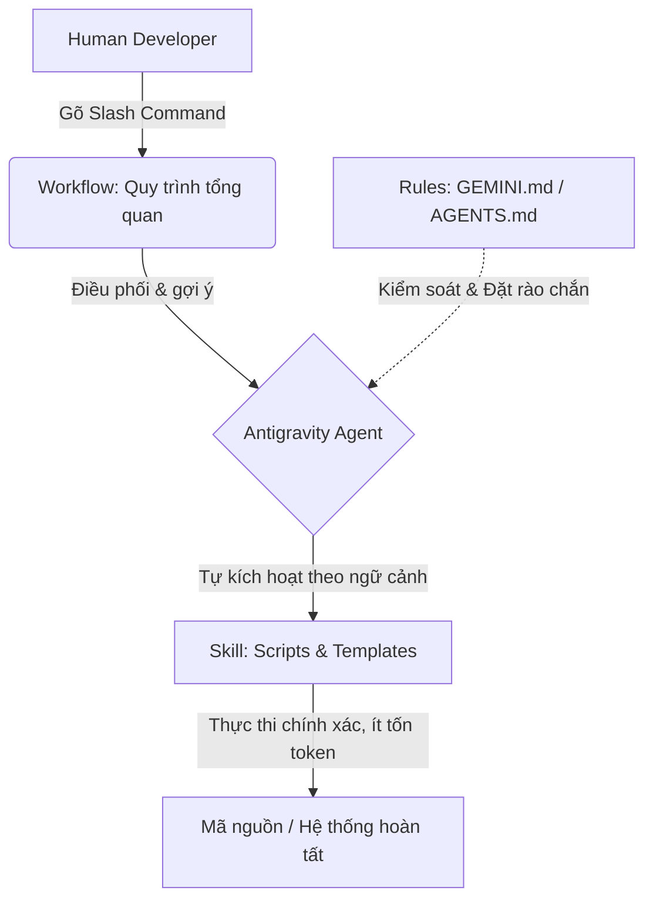

Hiểu rõ sự khác biệt giữa **workflow và skill trong Antigravity** là chìa khóa giúp bạn làm chủ trợ lý AI, thay vì để nó liên tục sinh mã tùy tiện và ngốn hàng nghìn token không cần thiết.

Hôm trước ngồi cà phê với một bạn lập trình viên cấp dưới trong nhóm, bạn ấy hỏi mình một câu rất chân thật: *"Em thấy gõ lệnh chạy workflow hay để agent tự gọi skill thì kết quả cuối cùng nó cũng sinh code, cũng sửa file y chang nhau. Chẳng thấy khác gì, tại sao Google Antigravity phải tách ra hai khái niệm cho mất công vậy anh?"*

Lúc đó mình cũng thoáng khựng lại vài giây. Để giải thích rành mạch và thuyết phục, mình đã về lục lại toàn bộ tài liệu chính thức của Google Antigravity lẫn các bài hướng dẫn trên Google Codelabs. Kết quả là các tài liệu đó giải thích khá trừu tượng, hoặc chỉ lướt qua định nghĩa kỹ thuật mà không nói rõ bản chất vận hành trong thực tế.

Sẵn trải nghiệm làm việc thực chiến hàng ngày với Antigravity và quy trình [Spec-Driven Development (SDD)](/spec-driven-development/), mình viết bài này để chia sẻ chi tiết góc nhìn và cách tổ chức khoa học nhất.

> **Tóm tắt cốt lõi (TL;DR):**
> - **Cơ chế kích hoạt:** **Workflow** do con người chủ động gõ lệnh kích hoạt (Human-in-the-loop qua Slash Command `/ten-workflow`). **Skill** do Agent tự đánh giá ngữ cảnh và kích hoạt ngầm (Autonomous) nhờ cơ chế Progressive Disclosure.
> - **Cấu trúc & Tài nguyên:** **Workflow** là một file markdown quy trình logic, khi cần làm agent vẫn phải sinh code từ đầu. **Skill** là một thư mục độc lập đóng gói sẵn script thực thi, tài liệu tham khảo và mẫu code — chạy trực tiếp với tham số động, giúp tiết kiệm token và tăng tốc đáng kể.
> - **Công thức phối hợp:** Con người chạy **Workflow** để dẫn đường $\rightarrow$ Workflow chỉ định các **Skills** để Agent xử lý chuyên sâu $\rightarrow$ **Rules** đóng vai trò hàng rào bảo vệ (guardrails) giữ agent không đi chệch hướng.

---

## Mục lục bài viết

1. [Bức tranh tổng thể: Ba trụ cột tùy biến trong Antigravity](#1-buc-tranh-tong-the-ba-tru-cot-tuy-bien-trong-antigravity)
2. [Khác biệt 1: Cơ chế kích hoạt — Ai là người ra quyết định?](#2-khac-biet-1-co-che-kich-hoat--ai-la-nguoi-ra-quyet-dinh)
3. [Khác biệt 2: Cấu trúc thư mục và kinh tế học Token](#3-khac-biet-2-cau-truc-thu-muc-va-kinh-te-hoc-token)
4. [Bảng so sánh chi tiết: Workflow vs Skill](#4-bang-so-sanh-chi-tiet-workflow-vs-skill)
5. [Tam giác phối hợp: Rules - Workflows - Skills](#5-tam-giac-phoi-hop-rules---workflows---skills)
6. [Kịch bản thực chiến: Viết bài chuẩn SEO hoặc Triển khai hệ thống](#6-kich-ban-thuc-chien-viet-bai-chuan-seo-hoac-trien-khai-he-thong)
7. [Những câu hỏi thường gặp (FAQ)](#7-nhung-cau-hoi-thuong-gap-faq)
8. [Lời kết](#8-loi-ket)

---

## 1. Bức tranh tổng thể: Ba trụ cột tùy biến trong Antigravity

Để không bị rối, trước hết chúng ta cần nhìn lại toàn bộ hệ thống tùy biến (Customization System) của Google Antigravity. Trợ lý AI trong Antigravity không vận hành một cách mơ hồ, mà được định hình bởi 3 thành phần rõ ràng:

1. **Rules (`GEMINI.md`, `AGENTS.md`, `.agents/rules/*.md`):** Các nguyên tắc bất di bất dịch, phong cách code, ràng buộc bảo mật. Rules luôn chạy nền hoặc tự nạp để đặt ra giới hạn "được làm gì và không được làm gì".
2. **Workflows:** Quy trình tác vụ nhiều bước (SOP - Standard Operating Procedure) do con người chủ động chọn chạy khi cần thực hiện một đầu việc lớn.
3. **Skills (`.agents/skills/<name>/`):** Bộ công cụ chuyên biệt đóng gói tri thức, mẫu thực thi và script tự động để Agent tự đem ra dùng khi đụng việc tương ứng.



Khi nhìn vào sơ đồ trên, bạn sẽ thấy ngay: Workflow và Skill không sinh ra để triệt tiêu lẫn nhau, mà nằm ở hai tầng điều phối hoàn toàn khác biệt.

---

## 2. Khác biệt 1: Cơ chế kích hoạt — Ai là người ra quyết định?

Điểm khác biệt căn bản nhất và dễ nhận thấy nhất nằm ở **chủ thể kích hoạt (Trigger Subject)**:

### Workflow: Con người chủ động kích hoạt (Human-driven)

Workflow phục vụ mô hình **Human-in-the-loop**. Khi bạn bắt đầu một phiên làm việc có chủ đích rõ ràng, bạn là người bấm nút:

- Bạn gõ lệnh Slash Command trong khung chat, ví dụ `/seo-content-writer`, `/code-review`, `/release-version`.
- Ngay lập tức, agent nạp kịch bản làm việc tương ứng và bắt đầu đối thoại hoặc hướng dẫn bạn qua từng bước của quy trình đó.
- Nếu không có sự chủ động gọi lệnh từ con người, Workflow sẽ nằm yên và không bao giờ tự ý can thiệp vào công việc của bạn.

### Skill: Agent tự giác kích hoạt (Autonomous Agent-driven)

Ngược lại hoàn toàn với Workflow, Skill được thiết kế để Agent **tự nhận diện và tự rút đồ nghề ra dùng**:

- Trong Antigravity, mỗi skill được đăng ký với một `name` và một đoạn `description` súc tích trong phần frontmatter của file `SKILL.md`.
- Antigravity áp dụng cơ chế **Progressive Disclosure** (Tiết lộ tăng tiến): Khi khởi động phiên chat, hệ thống không nhồi toàn bộ nội dung của hàng chục skill vào bộ nhớ context window. Nó chỉ đưa danh sách tên và mô tả ngắn gọn của các skill.
- Khi bạn giao một yêu cầu bất kỳ (hoặc khi agent nhận được kết quả từ một bước trước đó), agent sẽ tự rà soát mô tả: *"Nhiệm vụ này có khớp với chuyên môn của skill nào không?"*. Nếu thấy khớp từ khóa hoặc ngữ cảnh, agent sẽ tự nạp đầy đủ nội dung của `SKILL.md` và thực thi.
- Bạn không cần phải nhớ cú pháp gọi skill; Agent tự biết khi nào cần dùng búa, khi nào cần dùng cờ-lê.

---

## 3. Khác biệt 2: Cấu trúc thư mục và kinh tế học Token

Nhiều người thắc mắc: *"Tại sao phải tạo cả thư mục skill cồng kềnh, trong khi workflow chỉ cần 1 file Markdown là xong?"*

Câu trả lời nằm ở bài toán **tối ưu hóa token** và **tính tất định (deterministic) của mã nguồn**.

### Workflow: Một file hướng dẫn logic thuần túy

File workflow thường chỉ là một tài liệu Markdown (.md) mô tả quy trình dạng văn bản: bước 1 làm gì, bước 2 kiểm tra gì, bước 3 xuất báo cáo ra sao.

Hạn chế lớn nhất khi chỉ dựa vào file văn bản là: **Agent vẫn phải tự biên tự diễn phần thực thi**. Nếu bước 2 yêu cầu nén ảnh hoặc kiểm tra định dạng dữ liệu, LLM sẽ phải tự nghĩ ra một đoạn script Python/Bash tạm thời, viết ra đĩa rồi chạy. Việc này vừa ngốn nhiều token sinh mã, vừa tiềm ẩn nguy cơ lỗi (ảo giác - hallucination) do mỗi lần agent viết script một kiểu.

### Skill: Gói công cụ thực thi hoàn chỉnh (Modular Execution Package)

Skill trong Antigravity không bao giờ chỉ là một file `.md` đơn độc. Nó là một thư mục có cấu trúc chuẩn mực:

```text
.agents/skills/my-specialized-skill/
├── SKILL.md          # Bắt buộc: Hướng dẫn cốt lõi kèm YAML frontmatter
├── scripts/          # Tùy chọn: Shell script, Python script có thể chạy trực tiếp
├── examples/         # Tùy chọn: Code mẫu, payload mẫu đạt chuẩn
├── resources/        # Tùy chọn: File cấu hình, templates cố định
└── references/       # Tùy chọn: Tài liệu chuyên sâu (chỉ đọc khi thực sự cần)
```

Sức mạnh của cấu trúc này nằm ở:

1. **Có sẵn mã thực thi (`scripts/`):** Thay vì yêu cầu LLM viết 50 dòng code phân tích JSON, bạn viết sẵn một script `analyze.py` trong thư mục `scripts/`. Agent chỉ việc gọi lệnh `python scripts/analyze.py --input data.json` với tham số động. 
2. **Tiết kiệm token vượt trội:** LLM chỉ tốn vài chục token để truyền tham số, thay vì tiêu tốn hàng nghìn token để viết đi viết lại đoạn mã xử lý.
3. **Tốc độ và độ tin cậy tuyệt đối:** Script viết sẵn chạy ngay lập tức, không có độ trễ sinh mã và kết quả luôn đồng nhất 100% qua mọi lần chạy.
4. **Tách rời tài liệu nặng (`references/`):** Những bảng đặc tả API hàng nghìn dòng được để riêng trong thư mục `references/`. Khi nào agent gặp trường hợp cá biệt, nó mới đọc file đó, giữ cho cửa sổ ngữ cảnh (Context Window) luôn thông thoáng.

---

## 4. Bảng so sánh chi tiết: Workflow vs Skill

Dưới đây là bảng tổng hợp các điểm khác nhau cốt lõi giúp bạn dễ dàng tra cứu:

| Tiêu chí so sánh | Workflow (Quy trình) | Skill (Kỹ năng đóng gói) |
| :--- | :--- | :--- |
| **Bản chất** | Kịch bản điều phối công việc từng bước (SOP) | Hộp đồ nghề tri thức & công cụ chuyên biệt |
| **Đối tượng kích hoạt** | Con người gõ lệnh chủ động (`/ten-workflow`) | Agent tự kích hoạt dựa trên ngữ cảnh hoặc mô tả |
| **Cấu trúc lưu trữ** | 1 file Markdown (`.agents/workflows/*.md`) | Thư mục gồm `SKILL.md` + `scripts/` + `references/` |
| **Cơ chế nạp bộ nhớ** | Nạp toàn bộ kịch bản ngay khi người dùng gõ lệnh | **Progressive Disclosure** (chỉ nạp tên/mô tả trước, nạp chi tiết khi cần) |
| **Khả năng thực thi** | Agent phải tự suy luận và tự sinh code mới | Tận dụng trực tiếp các script và template có sẵn |
| **Tối ưu Token** | Tốn nhiều token hơn do agent phải tự sinh mã trung gian | Tiết kiệm token tối đa, giảm thiểu chi phí và thời gian |
| **Mục đích sử dụng** | Định hướng *dòng chảy công việc* (Workflow orchestration) | Cung cấp *năng lực giải quyết bài toán cụ thể* (Domain capabilities) |

---

## 5. Tam giác phối hợp: Rules - Workflows - Skills

Trong các dự án thực tế, câu hỏi đúng không phải là *"Nên dùng Workflow hay dùng Skill?"*, mà là **"Phối hợp bộ ba này như thế nào để hệ thống chạy êm nhất?"**.

Kinh nghiệm của mình là áp dụng mô hình **Tam giác vàng điều phối**:

```text
         [ 1. WORKFLOW ]
     (Human triggers the flow)
             /       \
            /         \
           v           v
   [ 2. RULES ] <----> [ 3. SKILLS ]
(Guardrails keep     (Pre-built tools
 agent on track)      execute tasks)
```

1. **Tầng 1 - Workflow dẫn dắt:** Khi bạn bắt đầu một công việc lớn, hãy gõ một Slash Command. Workflow vạch ra bức tranh tổng quát: bước nào làm trước, bước nào làm sau, yêu cầu đầu ra của từng giai đoạn là gì.
2. **Tầng 2 - Workflow gợi ý Skill:** Trong nội dung workflow, bạn khéo léo mô tả các yêu cầu kỹ thuật để kích hoạt đúng các skill chuyên biệt mà bạn đã cài sẵn trong dự án.
3. **Tầng 3 - Rules giữ kỷ luật:** Toàn bộ quá trình agent đọc workflow và gọi skill đều phải tuân thủ nghiêm ngặt các điều luật trong `GEMINI.md` hoặc `AGENTS.md`. Rules là chiếc phanh an toàn ngăn agent xóa nhầm dữ liệu, vi phạm chuẩn đặt tên hoặc đi lệch phạm vi yêu cầu.

Nhờ cách phân tầng này, việc quản lý [Second Brain với LLM](/xay-dung-second-brain-voi-llm/) hay tự động hóa lập trình hàng ngày trở nên ngăn nắp và cực kỳ tin cậy.

---

## 6. Kịch bản thực chiến: Viết bài chuẩn SEO hoặc Triển khai hệ thống

Hãy lấy một ví dụ rất gần gũi: Bạn muốn xây dựng một quy trình viết bài blog kỹ thuật chuẩn SEO trên blog cá nhân.

Thay vì ngồi gõ một prompt dài ngoằng mỗi lần viết bài, bạn cấu hình hệ thống như sau:

### Bước 1: Thiết lập Rules (`GEMINI.md`)
Bạn đặt ra các giới hạn vĩnh viễn:
- Tiêu đề SEO tối đa 60 ký tự, từ khóa chính ở đầu.
- Meta Description tối đa 160 ký tự.
- Luôn giao tiếp bằng tiếng Việt, xưng "mình" và gọi người đọc là "bạn".

### Bước 2: Tạo Skill SEO (`.agents/skills/seo-content-writer/`)
Trong thư mục skill này, bạn cung cấp:
- `SKILL.md`: Các tiêu chuẩn chất lượng (CORE-EEAT), công thức giật tít, checklist 9 bước viết bài.
- `scripts/verify-links.sh`: Script kiểm tra tự động xem các internal links trong bài có bị 404 hay không.

### Bước 3: Tạo Workflow Xuất Bản (`/publish-blog`)
Khi bạn muốn viết bài mới, bạn chỉ cần gõ:
```bash
/publish-blog "Workflow và Skill trong Antigravity"
```

**Dòng chảy vận hành bên dưới sẽ diễn ra:**
1. Workflow khởi chạy, yêu cầu bạn nhập dàn ý sơ bộ hoặc các ý tưởng cốt lõi.
2. Agent đọc yêu cầu, nhận thấy cần tối ưu hóa bài viết nên **tự động kích hoạt skill `seo-content-writer`**.
3. Agent áp dụng toàn bộ kỹ năng viết chuẩn SEO từ skill, đồng thời chạy script kiểm tra đường dẫn trong thư mục `scripts/`.
4. Trong suốt quá trình đó, **Rules** giám sát để đảm bảo tiêu đề không vượt quá 60 ký tự và văn phong giữ đúng phong cách cá nhân của bạn.

Mọi thứ vận hành nhịp nhàng như một dây chuyền sản xuất tự động mà bạn không cần phải nhắc đi nhắc lại từng quy tắc nhỏ.

---

## 7. Những câu hỏi thường gặp (FAQ)

### Tôi có thể tự gõ lệnh kích hoạt một Skill giống như Workflow không?
Có. Trong Antigravity, bạn hoàn toàn có thể dùng cú pháp `@` để nhắc đến tên skill (ví dụ `@seo-content-writer`) nhằm ép buộc agent sử dụng skill đó ngay từ đầu. Tuy nhiên, bản chất thiết kế của skill vẫn ưu tiên cơ chế tự kích hoạt theo ngữ cảnh.

### Dự án của tôi nhỏ, tôi nên viết Workflow hay Skill trước?
Nếu bạn mới bắt đầu, hãy viết **Rules** trước để thiết lập phong cách làm việc. Tiếp theo, nếu bạn có một quy trình lặp đi lặp lại do bạn kiểm soát (như kiểm thử và tạo bản build), hãy tạo một **Workflow**. Khi nhận thấy trong workflow có những đoạn code/script phải tái sử dụng nhiều lần và muốn tiết kiệm token, đó là lúc thích hợp nhất để bạn đóng gói thành **Skill**.

### Điều quan trọng nhất khi viết một file `SKILL.md` là gì?
Đó chính là trường `description` trong phần frontmatter. Agent dựa vào mô tả này để quyết định có kích hoạt skill hay không. Một phần mô tả rõ ràng: *"Dùng skill này khi người dùng yêu cầu X, hoặc khi cần xử lý bài toán Y"* sẽ giúp agent gọi đúng đồ nghề, tránh tình trạng kích hoạt nhầm hoặc bỏ quên kỹ năng.

---

## 8. Lời kết

Việc phân tách giữa **Workflow** và **Skill** trong Antigravity thoạt nhìn có vẻ rườm rà, nhưng thực chất là một bước tiến quan trọng trong tư duy công nghệ: chuyển từ việc "chat với AI qua từng prompt đơn lẻ" sang "thiết kế kiến trúc hệ thống cộng tác với AI".

- **Workflow** trao cho bạn quyền kiểm soát dòng chảy công việc.
- **Skill** trang bị cho Agent công cụ chuyên môn sắc bén và tiết kiệm tài nguyên.
- **Rules** đảm bảo mọi thứ luôn vận hành trong tầm kiểm soát.

Khi bạn kết hợp hài hòa cả ba yếu tố này, trợ lý AI sẽ thực sự trở thành một người cộng sự ăn ý, giải phóng bạn khỏi những thao tác thủ công lặp lại để tập trung vào những bài toán kỹ thuật giá trị hơn.
